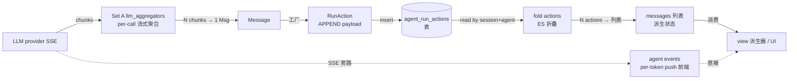
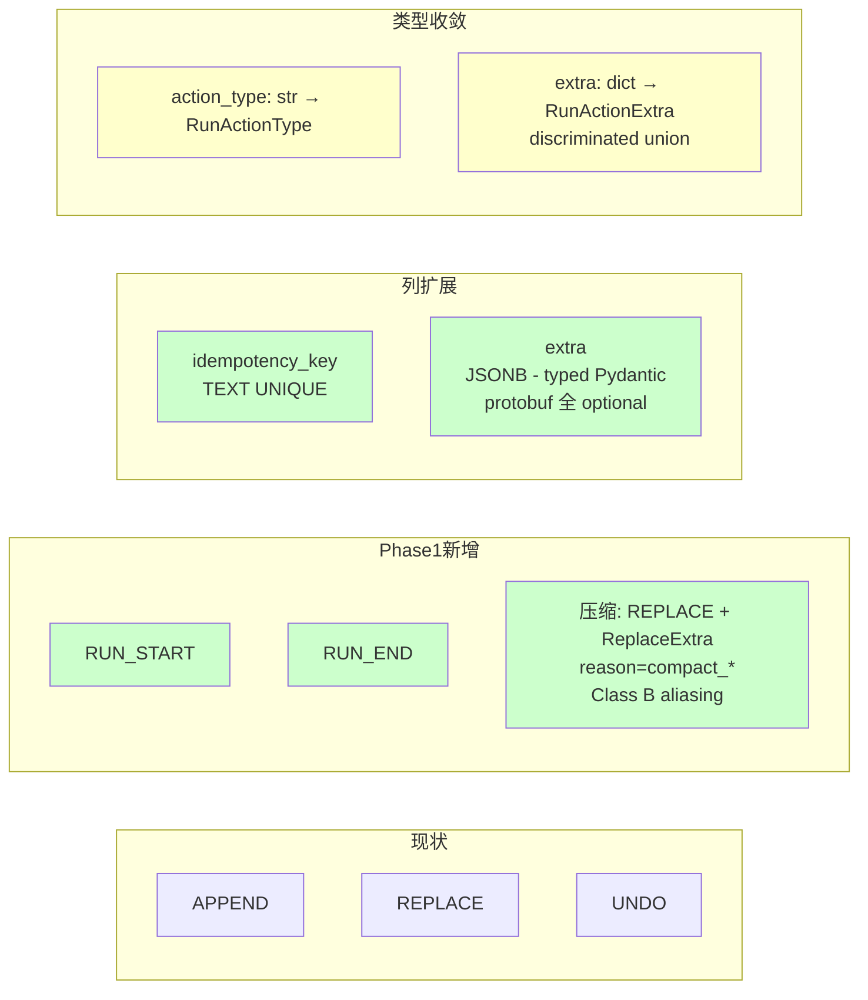
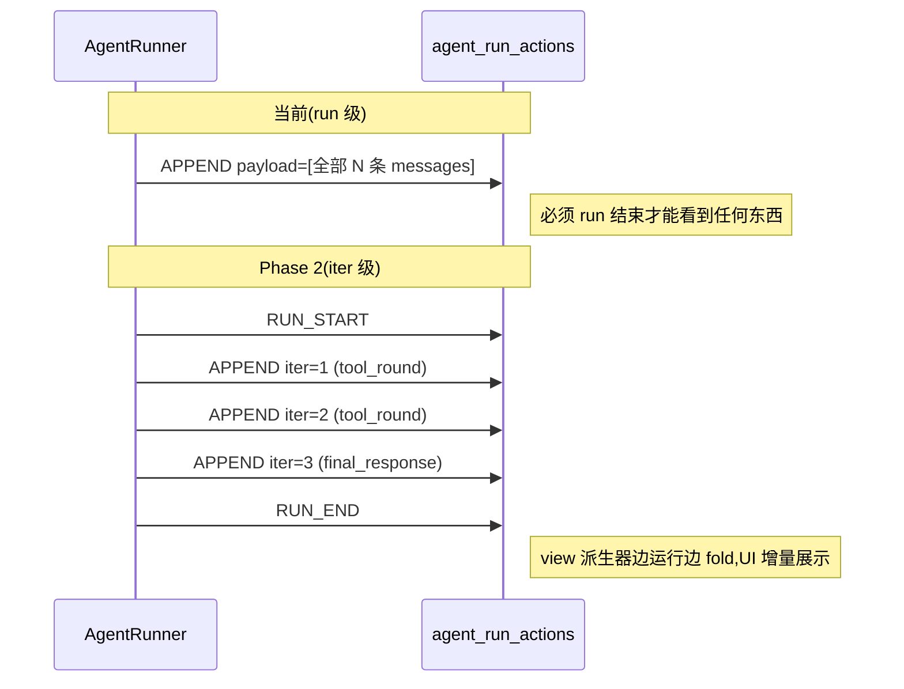

# RFC-0022: Agent Run Action 事件溯源协议(生命周期 / 压缩 / typed extra)

- **状态**: draft
- **优先级**: P2
- **标签**: `architecture`, `dx`, `protocol`, `event-sourcing`
- **影响服务**: NexAU (`AgentRunActionModel`);下游 NexAU Cloud (NAC) 中以 `agent_run_actions` 为 single source of truth 的 view 派生器
- **创建日期**: 2026-05-01
- **更新日期**: 2026-05-05

## TL;DR

把 `AgentRunActionModel` 显式抬升为 **event sourcing 中的 mutation 流**(每一条 RunAction 是对会话 messages 状态的一次 mutation,messages 列表是 fold 出来的派生视图)。Phase 1 落 3 件事:

1. **action_type 扩展** — 加 `RUN_START` / `RUN_END` 两种,凑齐 5 个 reduction operator;压缩走 Class B aliasing(`REPLACE + ReplaceExtra(reason="compact_*")`),不开独立 type(详见 §设计原则 §6 forward-compat 分类)
2. **2 列新字段** — `idempotency_key`(流式幂等键)/ `extra`(typed Pydantic discriminated union)
3. **类型化收敛** — `action_type: str` 列保持 `str`(forward-compat,详见 §6),写入侧用 `RunActionType` StrEnum 强校验;`extra: dict` → 5 个 `*Extra` Pydantic 类(`AppendExtra` / `ReplaceExtra` / `UndoExtra` / `RunStartExtra` / `RunEndExtra`),按 **protobuf 哲学**全字段 optional + `extra='allow'`,废除自创 `extra.kind` magic string

iter 级持久化粒度切换是 **Phase 2 的事**,本 RFC 只把协议改对,让 Phase 2 有承接能力。

## 名词解释

本协议的核心术语:

| 术语 | 定义 |
|------|------|
| **action** / **RunAction** | 本协议的最小 atom,一行 `agent_run_actions` 表数据,代表对会话 messages 状态的一次 mutation。本 RFC 中 `action` ≡ `mutation` |
| **mutation** | action 的语义说法,指"对 messages 状态的一次变更"。本 RFC `action` ≡ `mutation` |
| **messages 状态** | `fold(actions)` 折叠出的当前 messages 列表(派生视图,**不是物化表**) |
| **fold** / **reduction** | actions 序列 → messages 状态的折叠运算(类似 functional `reduce`) |
| **action_type** | 5 种 reduction operator 标签:`APPEND` / `REPLACE` / `UNDO` / `RUN_START` / `RUN_END`(压缩走 `REPLACE + ReplaceExtra(reason="compact_*")` Class B aliasing) |
| **iter** / **iteration** | 一次 LLM iter:`LLM call → 模型响应 → tool 执行 → 回写 tool result` |
| **run** | 一次 `agent.run(message=...)` 调用周期,一个 run 包含 N 个 iter,用 `run_id` 标识 |
| **session** | 多个 run 的容器,用 `session_id` 标识,跨 run 共享 messages 状态 |
| **agent event** | Set A `nexau/archs/llm/llm_aggregators/` emit 的流式 SSE event(per-token / per-block),由前端 SSE 直接消费,**不进 RunAction 流** |

数据流的两层(看清"Set A 流式聚合"vs"本 RFC fold"在不同步骤):



## 改动一览



全部改动都在 `nexau/archs/session/models/agent_run_action_model.py` 一个文件 + 工厂方法。2 个新工厂:`create_run_start` / `create_run_end`,以及 `create_replace` 扩展 `reason="compact_*"` + `strategy` / `focus_instructions` / `stats` 参数,sig 接 typed extra。

**显式不在本 RFC 范围**:
- `SubagentCallBlock` 一等化 — 移到 [Phase 4](#phase-4--sub-agent-完整设计独立-pr),需配合 `ToolResultBlock` pairing 设计
- `extra.ids` 跨 mutation 关联约定 — 0 真消费者,等真需求出现 co-design

## 动机

`AgentRunActionModel` 已支持 APPEND / REPLACE / UNDO 三种 action_type,事实上一直就是事件溯源形态。但 framing 隐含 + 协议层 4 个缺口:

1. **事件溯源契约未显式化** — reduction 算子规则散落代码注释,各消费者各自悟、各自实现,边界处理参差
2. **Run 生命周期标记缺位** — 没有 mutation 表达 run begin/end,消费者靠"看到首条 APPEND"推断
3. **流式幂等键缺位** — Phase 2 iter 级要求多次小 mutation,没字段做 dedup,重连重试会重复 apply
4. **压缩边界不可识别** — `ContextCompactionMiddleware` 走 REPLACE,view 层只能 grep `summary` 字符串猜是 `/clear` 还是 compaction

## 非目标

- 不改现有压缩策略行为(`SlidingWindowCompaction` / `ToolResultCompaction` / `UserModelFullTraceAdaptiveCompaction` 沿用)
- 不替换 RFC-0021 sandbox `transcript.jsonl` 旁路(两者正交:那条召回原文,本 RFC 识别压缩边界)
- 不强制老消费者切新字段(`idempotency_key` NULL = 批量路径继续合法)
- 不引入消息级 fork / edit 语义(`parent_message_id` 已撤回,见 §权衡 §1)
- 不实现 per-token / per-block 持久化(走 Set A agent events SSE 旁路)
- 不引入 `SubagentCallBlock` 一等块(Phase 4 跟 result pairing 一起做)
- 不引入 `extra.ids` 跨 mutation 关联 namespace(0 真消费者,等真需求 co-design)

## 设计原则

本 RFC 的所有具体改动从这 5 条原则推下来。

### §1. Event Sourcing framing — RunAction 是 mutation,messages 列表是派生状态

**Mutation = 一条 RunAction(action)**:对会话 messages 状态的一次变更,是本协议的最小 atom。一次 mutation 的 payload 里仍然可以包含 N 条完整 message——粒度的关键是"一次状态变更",**不是单条 message,不是 token,也不是 block 切片**。

**messages 状态 = `fold(actions)`**:不是物化表,而是把所有 actions 按 `(session_id, created_at_ns, action_id)` 顺序折叠出来的派生视图。view 派生器、replay middleware、UI 时间线都跑这个 fold。

> 持久化最小粒度永远是 mutation;LLM streaming 的 token / block 级流式展示走 Set A `llm_aggregators` emit 的 agent events,**不进 RunAction 流**(见 §未解决问题 #3)。

### §2. Reduction algebra — 2 个 state operator + 1 个 perf 捷径 + 2 个 lifecycle marker

5 个 action_type 不是 5 个独立设计点,而是这样分层的:

| 类别 | action_type | 是否改 messages state | 角色 |
|------|------------|---------------------|------|
| **State operator** | `APPEND` | ✅ extend | 增量主力 |
| **State operator** | `REPLACE` | ✅ full assign | 覆盖一切"wipe-and-reset"语义(/clear、/compact、debug import……都是 reason 不同的 REPLACE) |
| **Perf 捷径** | `UNDO` | ✅ assign-from-snapshot | **理论上可以用 REPLACE 表达**(把目标 run 之前的 state 当 payload 写一遍),UNDO 的存在只是为了"不用每次把整个 state 物化进 row" |
| **Lifecycle marker** | `RUN_START` | ❌ Class A reader-NOOP | 给 reducer 一个拍 in-memory snapshot 的 hook(让 UNDO 走 O(1) 快路径) + 给 view 派生器一个 run 边界 |
| **Lifecycle marker** | `RUN_END` | ❌ Class A reader-NOOP | 给 view 派生器一个 run 完成信号 + 携带 status/finished_at_ns 等元数据 |

**第一性原则**:协议本质是 `APPEND` + `REPLACE`,这两个算子已能表达任何 messages state 变更。新增 action_type 的判据先过这一关——

> 这个变更能不能用 `APPEND` 或 `REPLACE` 表达?
> - 能 → 走 Class B aliasing(`REPLACE + ReplaceExtra(...)` 加字段),不开新 type
> - 不能 → 是真正的新算子,继续过 §4 + §6 Class C 准入(必须有 reader version gate)

压缩当时栽在第一关:`REPLACE(payload=summary)` 完全可以表达,所以不该开 `COMPACT`。 `UNDO` 也算栽在第一关——但栽得有道理:它能用 REPLACE 表达,但写放大不能接受(每个 RUN_START 都要把当时的全部 state 物化进 row;现在的设计 RUN_START 是空 payload,详见 §Reduction 算法 snapshot 章节)。

新增 action_type 必须满足 §4 的判据,且不允许"语义混在 extra 里"。

### §3. Typed extra(Pydantic discriminated union per action_type, protobuf 哲学)

`extra` 字段在 DB 层是 JSONB,但**协议层提供 typed Pydantic discriminated union**(`RunActionExtra`),按 `action_type` dispatch。每个 action_type 有自己的 `*Extra` Pydantic 类(`AppendExtra` / `ReplaceExtra` / ...),**不允许 generic `kind: str` magic string** —— 用专门字段名(`reason` / `trigger` / `status` 等)。

**借鉴 protobuf 的 schema evolution 哲学,但用 Pydantic 实现**(不真用 protobuf,见 §权衡 §7):
- 所有 *Extra 字段 `T | None = None`(包括"业务必填"如 `RunEndExtra.status`)
- `model_config = ConfigDict(extra='allow')` 老 reader 忽略未知字段不崩
- *Extra body 用 `str` 留 canonical 值文档化(保证未来加新 enum value 不破坏老 SDK)
- **工厂方法 sig 用 `Literal[...]` 强校验业务必填**(写入侧 strict + IDE autocomplete)
- 不引入 `schema_version` 列(字段级演进已够,见 §权衡 §6)

参考的反面教材:
- ❌ `extra={"kind": "user_clear"}` — 自创字符串 namespace,view 层 grep 才能识别
- ✅ `ReplaceExtra(reason="user_clear")` 协议层 + `create_replace(reason: Literal["user_clear", ...])` 工厂层 — typed,双层防御

> **`extra.ids` namespace 不在 Phase 1 引入**。原 RFC 草案曾设计 `extra.ids` 用于 cross-mutation correlation 查询(swimlane UI、billing audit、`tool_use_id` → 引入 mutation 等)。但当前 0 真实消费者(NAC frontend / item_writer / reconciler 都不需要),写入侧需 bookkeeping 同步、GIN 索引写放大、schema 演进锁死,代价大于收益。**等真消费者出现时再 co-design**(可能加专用 top-level column 如 `trace_id`,或 per-Extra 的强类型字段)。

### §4. 何时开新 action_type vs 走 typed extra field

参考 RxJS / PyTorch 算子设计的工业经验:

> RxJS:`take(n)` 不开 `take5`,但 `take` / `takeUntil` / `takeWhile` 是独立算子,因为参数语义不同。
> PyTorch:`conv2d(stride=2)` 不开 `conv2d_stride2`,但 `relu` / `gelu` / `sigmoid` 是独立 op,因为 forward + gradient + perf 都不同。

**开新 `action_type` 当且仅当满足以下任一**:

1. **不同的 reduction 算子**(forward 不同) — 例:APPEND vs REPLACE
2. **不同的 lossiness / durability 语义**,且消费者必须 dispatch — 例(假设性):一个完全无法 fold 进现有算子的新算子;**注意**这条还要再过 §6 forward-compat 分类,如果是 Class C 必须有 reader gate
3. **携带专门的 schema 字段集**(per-Extra 类有自己的 typed field set),不只是字符串 tag — 例:`RunEndExtra(status, finished_at_ns, ...)` 不是 `extra.kind="run_end"`

**否则用 typed extra 内的 `Literal[...]` enum field**(替代自创 `extra.kind`):
- `/clear` → `REPLACE + ReplaceExtra(reason="user_clear")`
- 系统 reset → `REPLACE + ReplaceExtra(reason="user_replace")`
- 用户编辑前面消息重发 → `UNDO + UndoExtra(reason="user_edit")`
- crash recovery 重发 → `UNDO + UndoExtra(reason="system_recover")`
- 压缩 → `REPLACE + ReplaceExtra(reason="compact_auto" / "compact_manual" / "compact_focused", strategy=..., stats=...)`(详见 §6 Class B aliasing)

按这条准则,Phase 1 的 5 个 action_type 全部合理:
- `APPEND` 满足 (1) extend
- `REPLACE` 满足 (1) full assign;压缩(Class B aliasing,见 §6)复用 REPLACE 而非开新 type
- `UNDO` 满足 (1) assign from snapshot
- `RUN_START` 满足 (1) 不改 state + 触发 reducer 内部 snapshot,**和** (3) 携带 `trace_id` 专门 schema(Class A reader-NOOP,见 §6)
- `RUN_END` 满足 (1) 仅边界标记,**和** (3) 携带 `status` / `finished_at_ns` 专门 schema(Class A reader-NOOP)

> **§4 不是单独决策点**:任何看似满足 §4 的新 action_type 还要再过一轮 §6 forward-compat 分类,看它是 Class A / B / C。Class C 类型必须有协调发布通道(reader gate),否则就要降级为 Class B aliasing。早期 Phase 1 设计稿里的 `COMPACT` 就是这样从"独立 action_type"被重分类为 Class B。

### §6. Forward-compat 分类 — Class A / B / C(新增 action_type 的准入规则)

**问题陈述**:NAC 上 agent runtime 镜像不会随每个 PR 重新部署,生产环境会**长期共存多个版本的 nexau SDK**。如果新版 SDK 写入了一种老版 SDK 不认识的 `action_type`,老 reader 在 fold 时会出现两类崩溃:

1. **Hard crash**:`RunActionType` 是 SQL ENUM → SELECT 时 `LookupError`(已通过 `action_type: str` 列类型规避)。
2. **Silent semantic corruption**:更危险——老 reader 没匹配到分支,默认走"跳过",但新 type 实际上**会改变 messages state**(例如压缩),老 reader 直接拿到爆炸性大的上下文 OOM,而且没有任何报错。

每个新 `action_type` 在合入前必须明确归类到下面三类之一,并满足相应准入条件。

| Class | 名称              | 老 reader 默认行为 | 是否安全                 | 例子                  |
| ----- | ----------------- | ----------------- | ----------------------- | --------------------- |
| **A** | Reader-NOOP       | 跳过(`pass`)    | ✅ 安全                | `RUN_START` / `RUN_END` |
| **B** | Old-Type Aliasing | 走老 type 分支    | ✅ 语义正确            | 压缩走 `REPLACE`      |
| **C** | Coordinated       | 跳过 → silent corruption | ⚠️ 必须有 reader gate | (Phase 1 没有)        |

**Class A — Reader-NOOP**:新 type 不改变 messages state,老 reader 跳过等价于不应用,无 semantic gap。准入:reduction 算子在所有 reader 版本里都是恒等(`pass`)。Phase 1 的 `RUN_START` / `RUN_END` 属于此类——它们只在 reducer 内部维护 snapshots / 仅作边界标记,老 reader 跳过完全正确。

**Class B — Old-Type Aliasing**:新行为 piggyback 到老 `action_type` 上(`REPLACE` / `APPEND` / `UNDO`),通过 `*Extra` 字段区分子语义。老 reader 看到的是熟悉的老 type → 走熟悉的 fold 算子 → state 正确;只是不认识 extra 里的子语义,但因为 fold 算子已经做对了事,**无 semantic gap**。准入:新行为的 fold 算子和某个现有 type 完全一致(state 计算等价),只是消费层(view 派生器、UI、监控)需要区分。Phase 1 的压缩属于此类——`REPLACE + ReplaceExtra(reason="compact_*", strategy=..., stats=...)`。

**Class C — Coordinated Rollout**:新 `action_type` 改变 state 且无现有等价 type 可 alias。老 reader 无法正确 fold,**必须**通过 reader 版本门控避免老 reader 处理新 row(否则 silent corruption)。准入(三选一):
- **Min-reader-version 列**:row 携带 `min_reader_version`,老 reader 看到 row 的 `min_reader_version > 自己` → loud error 拒绝(不 silent skip)。
- **Reader 拒绝未知 type**:老 reader 把未知 `action_type` 视为 fatal error 而不是默默跳过(代价:任何新 type 都会让老 reader 全炸)。
- **协调发布**:确保所有 reader 已升级再发布 writer 的能力(NAC 多租户场景几乎不可能)。

**Phase 1 没有 Class C 类型**。早期设计稿里的 `COMPACT` 当时是 Class C(改 state、无等价老 type),会在 NAC 滚动升级期间撞 silent OOM,因此被重分类为 Class B(REPLACE + `compact_*` reason)。这个重分类的代价:view 派生器要 `WHERE action_type='REPLACE' AND extra->>'reason' LIKE 'compact_%'` 而不是 `WHERE action_type='COMPACT'`——多一个 WHERE 子句,换掉了 silent context-overflow OOM 的生产事故,完全划算。

**新 type 准入清单(checklist)**:

```
[ ] 这个 type 改变 messages state 吗?
    [ ] 否 → Class A,加 case 即可
    [ ] 是 → 继续
[ ] 它的 fold 算子等价于某个现有 type 吗?
    [ ] 是 → Class B aliasing,在 *Extra 加字段而不是开新 type
    [ ] 否 → Class C,必须有 reader version gate;否则不要合入
[ ] 在 forward-compat 矩阵测试里加一条
    (test_run_action_db_roundtrip.py::test_action_type_unknown_value_does_not_crash_old_reader 同款)
```

### §5. Mutation 粒度演进 — run 级 → iter 级(Phase 2)

**当前**:`AgentRunner` 在 run 结束时一次性 `create_append(messages=[...全部 N 条])`,1 run = 1 RunAction。**过粗**:长 run 期间 DB 看不到中间 mutation、崩溃丢全部进度、UI 无法边运行边展示。

**Phase 2 目标**:每个 iter 写一条 APPEND,RUN_START/RUN_END 头尾包夹。



**Phase 2 阻塞条件**:[RFC-0023 §阶段 ③](0023-aggregator-unification.md) — 完成 ✅(2026-05 nexau main 已合)。

**事件溯源契约不变**:reduction 算法相同,只是 mutation 更密、payload 更小,老 fold 实现继续工作。

## 详细设计

### §6.1 RunActionType 全集

| action_type   | reduction 算子                                                                    | 主 payload 列                            | extra 类型           |
| ------------- | --------------------------------------------------------------------------------- | --------------------------------------- | ------------------- |
| `APPEND`      | `state.extend(append_messages)` — 追加 N 条                                        | `append_messages: list[Message]`        | `AppendExtra`       |
| `REPLACE`     | `state = replace_messages` — 全量替换                                              | `replace_messages: list[Message]`       | `ReplaceExtra`      |
| `UNDO`        | `state = snapshot(undo_before_run_id)` — 回滚到目标 run 起点的快照               | `undo_before_run_id: str`               | `UndoExtra`         |
| `RUN_START`   | **不改 messages 状态** — reducer 内部 `snapshots[run_id] = list(state)`(供 UNDO) | (无 payload)                            | `RunStartExtra`     |
| `RUN_END`     | **不改 messages 状态** — 仅边界标记                                                | (无 payload)                            | `RunEndExtra`       |

**压缩复用 `REPLACE`(Class B aliasing,详见 §6)**:`REPLACE + ReplaceExtra(reason="compact_auto" / "compact_manual" / "compact_focused", strategy=..., focus_instructions=..., stats=...)`。fold 算子和普通 REPLACE 完全一致,view 派生器通过 `extra->>'reason' LIKE 'compact_%'` 识别压缩边界。这避免了开 Class C 新 type 在多版本 SDK 共存时的 silent context-overflow OOM。

### §6.2 RunAction schema 完整列表

按"类型化档次"分三档:

#### 档 1:强类型 top-level 列(13 个)

| 列                       | 类型                                | 说明                                  |
| ------------------------ | ----------------------------------- | ------------------------------------- |
| `action_id`              | `str` (PK, UUID)                    | 行 PK,自动生成                       |
| `user_id`                | `str`                               |                                       |
| `session_id`             | `str`                               |                                       |
| `agent_id`               | `str`                               |                                       |
| `run_id`                 | `str`                               | 一次 `agent.run()` 调用               |
| `root_run_id`            | `str`                               | 子 agent 树根                        |
| `parent_run_id`          | `str \| None`                       | 子 agent 父 run                      |
| `agent_name`             | `str`                               |                                       |
| `created_at`             | `datetime`                          |                                       |
| `created_at_ns`          | `int` (`time.time_ns()`)            | 排序用;sparse,可能撞,见 §不变量 #3 |
| `action_type`            | `str` (storage) / `RunActionType` StrEnum (write-side) | 5 种,见 §6.1;列类型保持 `str` 以保 forward-compat,详见 §设计原则 §6 |
| `undo_before_run_id`     | `str \| None`                       | 仅 UNDO 用                            |
| `idempotency_key`        | `str \| None` (UNIQUE,允许多 NULL) | 流式写入幂等键,约定 `"{run_id}:{iter_index}"`;批量 APPEND 留 NULL |

#### 档 2:JSONB + Pydantic 校验(3 个)

| 列                   | 类型                                                   | 说明                          |
| -------------------- | ------------------------------------------------------ | ----------------------------- |
| `append_messages`    | `list[Message] \| None` via `PydanticJson(list[Message])` | 仅 APPEND 用                  |
| `replace_messages`   | `list[Message] \| None` via `PydanticJson(list[Message])` | REPLACE 用(包括压缩走的 Class B aliasing,reason="compact_*") |
| `extra`              | `RunActionExtra \| None` via `PydanticJson(RunActionExtra)` | discriminated union by action_type, 见 §6.3 |

#### 档 3:catchall(0 个)

无。Phase 1 完全消除 raw `dict[str, object]` JSONB(原 `extra: dict` 已升级到档 2)。

#### `action_type` 类型化收敛

之前 `action_type: str = Field(...)  # RunActionType value` 注释说是 enum 但类型是 raw str。本 RFC 在 SDK 层把工厂方法收敛成构造 `RunActionType` StrEnum 实例(StrEnum 自动转 str 写入),DB 列 + Python 字段类型**仍保持 plain `str`**——保 forward-compat:老 SDK 读到新版本 SDK 写的未知 `action_type` 字符串不会 `LookupError` 崩,详见 §设计原则 §6 Class A/B/C。

### §6.3 Typed `*Extra` Pydantic 类

两层 discriminated union:

1. **顶层** by `action_type`:`RunActionExtra = AppendExtra | ReplaceExtra | UndoExtra | RunStartExtra | RunEndExtra`
2. **`ReplaceExtra` 内部**再 by `reason`:5 个 variant + 1 个 unknown fallback,**等价于 protobuf 的 `oneof variant { ... }`**

为什么 `ReplaceExtra` 用 union 而其他 *Extra 用 flat:`reason` 不同时携带的字段集**确实不同**(`UserClearVariant` 没有 `focus_instructions`,`CompactFocusedVariant` 的 `focus_instructions` 是 required)。flat all-optional 让 `ReplaceExtra(reason="user_clear", focus_instructions="...")` 这种语义不通的组合通过校验,union 在编译期就拦住。其他 *Extra 各 reason 子类型字段集相同,union 化没有收益,保持 flat。

```python
from pydantic import BaseModel, Field
from pydantic import BaseModel, ConfigDict


# === Shared config: 全字段 optional + extra='allow' (protobuf 哲学) ===
# 老 reader 读新数据 → 未知字段降级到 dict, 不崩
# 新 reader 读老数据 → 缺失字段 None default, 不崩
PROTOBUF_PHILOSOPHY = ConfigDict(extra='allow')


# === APPEND ===
class AppendExtra(BaseModel):
    """Phase 2 iter 级密集化时填充。Phase 1 batch APPEND 路径可全 None。"""
    model_config = PROTOBUF_PHILOSOPHY
    iter_index: int | None = None
    iter_kind: str | None = None  # canonical: "tool_round" / "final_response" / "subagent_call"
    llm_call_id: str | None = None
    trace_id: str | None = None


# === REPLACE — discriminated union(protobuf oneof 等价) ===
#
# 每个 reason 一个 variant class,字段集严格收敛:
# - UserClearVariant 没有 focus_instructions(写不出语义不通的组合)
# - CompactFocusedVariant 的 focus_instructions 是 REQUIRED(intent 必须保留)
# - UnknownReplaceVariant 是 protobuf oneof unknown-field 的等价物:未来加新
#   reason value 时,老 SDK 落到这里,raw payload 通过 extra='allow' 保留
#
# 调用侧 IDE 自动补全 / mypy / pattern matching 都拿到 per-variant 字段保证。

class CompactStats(BaseModel):
    """压缩 stats 子结构,挂在 Compact*Variant.stats 下。"""
    model_config = PROTOBUF_PHILOSOPHY
    pre_message_count: int | None = None
    post_message_count: int | None = None
    pre_tokens: int | None = None
    post_tokens: int | None = None


class _ReplaceVariantBase(BaseModel):
    model_config = PROTOBUF_PHILOSOPHY  # extra='allow' for forward-compat
    trace_id: str | None = None


class UserClearVariant(_ReplaceVariantBase):
    """User typed /clear or equivalent reset."""
    reason: Literal["user_clear"] = "user_clear"


class CompactAutoVariant(_ReplaceVariantBase):
    """Automatic context compaction(token threshold trigger)。"""
    reason: Literal["compact_auto"] = "compact_auto"
    strategy: str | None = None
    stats: CompactStats | None = None


class CompactManualVariant(_ReplaceVariantBase):
    """User invoked /compact without focus instructions。"""
    reason: Literal["compact_manual"] = "compact_manual"
    strategy: str | None = None
    stats: CompactStats | None = None


class CompactFocusedVariant(_ReplaceVariantBase):
    """User invoked /compact <focus_instructions> ——保留用户意图。

    Codex CLI / Claude Code / Cursor 都没把这个 intent machine-readable 持久化
    (它只活在送给 LLM 的 prompt 里);我们保留是为了后续 compaction、audit、
    "show user what they asked for" 类 UX。
    """
    reason: Literal["compact_focused"] = "compact_focused"
    strategy: str | None = None
    focus_instructions: str  # REQUIRED — 这个 variant 存在的唯一意义就是保留 intent
    stats: CompactStats | None = None


class UnknownReplaceVariant(_ReplaceVariantBase):
    """未来新 reason value 的兜底 — protobuf oneof unknown-field 等价物。

    老 SDK 读到新 reason → 落这里,raw payload 通过 extra='allow' 保留;fold
    算法不读 extra,所以 REPLACE state 语义仍正确。没这个 fallback,新 reason
    会变成 §6 Class C silent corruption 风险。
    """
    reason: str  # 任何不在已知判别集合里的字符串


def _discriminate_replace(v):
    """Callable Discriminator with fallback。"""
    reason = v.get("reason") if isinstance(v, dict) else getattr(v, "reason", None)
    if reason in ("user_clear", "compact_auto", "compact_manual", "compact_focused"):
        return reason
    return "__unknown__"


ReplaceExtra = Annotated[
    Annotated[UserClearVariant, Tag("user_clear")]
    | Annotated[CompactAutoVariant, Tag("compact_auto")]
    | Annotated[CompactManualVariant, Tag("compact_manual")]
    | Annotated[CompactFocusedVariant, Tag("compact_focused")]
    | Annotated[UnknownReplaceVariant, Tag("__unknown__")],
    Discriminator(_discriminate_replace),
]


# === UNDO ===
class UndoExtra(BaseModel):
    model_config = PROTOBUF_PHILOSOPHY
    reason: str | None = None  # canonical: "user_rewind" / "user_edit" / "system_recover"
    trace_id: str | None = None


# === RUN_START ===
class RunStartExtra(BaseModel):
    model_config = PROTOBUF_PHILOSOPHY
    trace_id: str | None = None  # W3C trace id (RFC-0024)


# === RUN_END ===
class RunEndExtra(BaseModel):
    model_config = PROTOBUF_PHILOSOPHY
    status: str | None = None  # canonical: "ok" / "error" / "cancelled" — 业务必填,工厂层强制
    finished_at_ns: int | None = None
    reason: str | None = None  # error / cancelled 时的原因文本(非结构化诊断)
    trace_id: str | None = None


# === Discriminated Union (按 RunAction.action_type dispatch) ===
RunActionExtra = AppendExtra | ReplaceExtra | UndoExtra | RunStartExtra | RunEndExtra
```

#### 双层防御(写入 strict / 读取 lenient)

工厂方法 sig 用 `Literal[...]` 强校验业务必填字段,内部构造 *Extra:

```python
@classmethod
def create_run_end(
    cls, *, run_id: str,
    status: Literal["ok", "error", "cancelled"],   # 写入 strict
    finished_at_ns: int,                            # 业务必填
    reason: str | None = None, trace_id: str | None = None,
) -> AgentRunActionModel: ...
```

读取侧 `RunActionExtra.model_validate(action.extra)` —— 未来加新 enum value(如 `status="degraded"`)老 reader 不崩,只是不识别。

#### 关于 `trace_id`

每个 *Extra 都有 `trace_id: str | None` —— 当前唯一确认的 cross-mutation 关联场景(跟 langfuse 对账)。其他 ID(`tool_use_ids` / `child_run_ids` 等)等真消费者 co-design。如果未来 trace_id 查询频繁可以提到 top-level column 加 GIN 索引。

## Reduction 算法

> 唯一权威实现是 `nexau/archs/session/agent_run_action_service.py::AgentRunActionService.load_messages`。本节描述它的工作方式。**测试不维护并行的"参考 fold",历史教训见 §决策记录**。

### 算法形态

production 是**分页流式 backward-scan + 早停 + UNDO 走 cutoff_ns**:

```python
async def load_messages(self, *, key) -> list[Message]:
    cursor = None              # created_at_ns 游标(分页用)
    page_size = 200
    cutoff_ns: int | None = None  # 任何 created_at_ns >= cutoff_ns 都被 UNDO 抹掉
    appends_desc = []          # 倒序收集的 APPEND
    base_replace = None        # 命中的最近 REPLACE 锚

    while True:
        page = await self._scan_actions_desc(key=key, page_size=page_size, cursor=cursor)
        if not page: break

        for action in page:
            # 1. UNDO 已确立的 cutoff:晚于 cutoff 的 action 全部跳过
            if cutoff_ns is not None and action.created_at_ns >= cutoff_ns:
                continue

            # 2. UNDO:查一次 target 的最早 created_at_ns,更新 cutoff_ns(取最早)
            if action.action_type == UNDO:
                target_first_ns = await self._first_action_ns_of_run(key=key, run_id=action.undo_before_run_id)
                if target_first_ns is not None:
                    cutoff_ns = target_first_ns if cutoff_ns is None else min(cutoff_ns, target_first_ns)
                continue

            # 3. REPLACE 是自包含 anchor → 早停(包括压缩 Class B aliasing reason="compact_*")
            if action.action_type == REPLACE:
                base_replace = action
                stop = True; break

            # 4. APPEND 收集
            if action.action_type == APPEND:
                appends_desc.append(action)

            # RUN_START / RUN_END 不进任何分支(Class A reader-NOOP)

        if stop: break
        cursor = page[-1].created_at_ns

    # 拼接:base_replace 的 messages + reverse(appends_desc) 的 messages,按 message.id 去重 + 后写覆盖前写
    return apply(base_replace) + flatten(reversed(appends_desc))
```

### 算法性质

- **分页流式**:永远不一次性 list 全 session,page_size=200。长 session 也不爆内存。
- **REPLACE 早停**:命中 REPLACE(包括压缩走的 reason="compact_*")立即停止反向扫描——前面的 actions 全可丢。配合定期 `/compact`,长 session fold 接近常数时间。
- **UNDO 走 cutoff_ns**:每个 UNDO 多查一次 `_first_action_ns_of_run`(target 最早时间戳),更新 cutoff;之后所有 `created_at_ns >= cutoff_ns` 的 action 跳过。**正确处理多 action 的 target run**(RUN_START + 多 APPEND + RUN_END 都被一并 cutoff,不漏)。
- **RUN_START / RUN_END 是 Class A NOOP**:不参与 state 计算,只是边界 marker(view 派生器 / Phase 2 idempotency_key 命名约定才用)。
- **不持久化任何派生状态**:无 snapshot 列、无内存 cache。事件溯源原则:DB 只存 events。

### 性能 bench(sqlite in-memory)

| scenario | n_actions | median_ms |
|---|---|---|
| pure-APPEND | 5000 | 117 ms (~22μs/action,主要是 DB 查询开销) |
| periodic-REPLACE/50(compaction) | 5000 | **2.3 ms**(REPLACE anchor 早停只 fold 50 个 tail) |
| RUN_START + APPEND + RUN_END | 5000 runs(15000 行) | 262 ms(线性 scale,markers 是纯查询开销) |
| APPEND + UNDO @ 中间 | 5000 | 103 ms(UNDO 多 1 次 `_first_action_ns_of_run`,几乎无 overhead) |

> Phase 2 起 fold / SQL 排序统一使用 `(created_at_ns, action_id)` 复合键消除 ns 撞歧义。

### UNDO 走一遍 trace

```
DB actions(chrono order):
  1. APPEND r1 [m1, m2]     ns=100
  2. RUN_START r2           ns=200
  3. APPEND r2 [m3, m4]     ns=210
  4. RUN_END r2             ns=220
  5. UNDO before=r2         ns=300

load_messages DESC scan(从 ns 最大开始):
  - UNDO ns=300: 查 r2 first ns = 200,cutoff_ns = 200,跳过
  - RUN_END r2 ns=220: 220 >= 200 → 跳过(被 UNDO 抹掉)
  - APPEND r2 ns=210:  210 >= 200 → 跳过
  - RUN_START r2 ns=200: 200 >= 200 → 跳过
  - APPEND r1 ns=100:  100 < 200 → 收集进 appends_desc

reversed(appends_desc) → [APPEND r1] → state = [m1, m2]  ✓
```

注意:DB 行不删(append-only),m3/m4 仍在表里;cutoff_ns 在 fold pass 内决定哪些被忽略,agent 看不到被 undone 的 messages。

### 排序键 — `(created_at_ns, action_id)` 复合键

`created_at_ns` 是 `time.time_ns()` 纳秒时间戳。多 worker 并发写、双写期 SDK + NAC 同时落同 run 的 actions、NTP 漂移等场景**理论可能撞**。撞了 PK 不冲突(action_id UUID 独立),但 ORDER BY 单键时相对顺序不确定——若两条撞的恰好是 APPEND + UNDO 或两条 REPLACE,fold 结果不可重现。

production `_scan_actions_desc` 已经用复合键 `("-created_at_ns", "-action_id")` 消除 ns 撞歧义。Phase 1 数据(7015 行)未观察撞,Phase 2 iter 级密度后撞概率显著上升但复合键已经覆盖。

### 决策记录:测试不维护并行的"参考 fold"

早期设计有一个 in-memory `fold(actions: list)` 作为"参考实现",property tests 跟它对账。结果两个实现 drift,**production 在多 action target run 的 UNDO 上有 silent bug 但被参考实现的 mock 行为掩盖**(`test_scenario_5_rewind` 用参考实现验 expected,实际 production 漏出 r2 的 APPEND,测试照样过)。

修复方式:删掉所有参考实现(`fold` / `fold_backward_anchor` / `_canonical_fold`),所有测试直接走 `AgentRunActionService.load_messages` 配合 sqlite in-memory engine。Hypothesis property tests 用同样的 helper(`fold(actions) := persist + load_messages`)。

教训:**不要为了"独立验证"维护算法的影子实现**,影子和真身一定 drift,而 drift 一定藏 bug。production 是唯一权威,测试和 RFC 都对它写。

## 不变量

> 1. 每个 `run_id` 至多一条 `RUN_START` 和一条 `RUN_END`(若 run 异常终止可能没有 RUN_END,reader 必须容忍;Phase 1 之前的老数据可能完全没有 RUN_START,production load_messages 不依赖 RUN_START 解析 UNDO,所以可正确处理)
> 2. `UNDO` 的 `undo_before_run_id` 应该能在 action stream 中找到至少一条 `run_id == undo_before_run_id` 的 action(无论是 RUN_START 还是 APPEND)。**当前 production 行为**:找不到时 silent no-op(UNDO 被忽略,messages 不变);**理想行为**:fail-loud 抛错。两者待对齐(follow-up issue),目前以 production 为准
> 3. `(session_id, created_at_ns)` 在单 session 内**单调递增**(多数平台单调,但纳秒时间戳是 sparse,**不是连续序号**,reader 不应假设无空洞);Phase 2 起 fold 排序使用 `(created_at_ns, action_id)` 复合键消除 ns 撞歧义
> 4. `idempotency_key`(若设置)在 `(session_id, ...)` 范围内唯一,允许多 NULL

## 与 RFC-0021 的关系

|         | RFC-0021 sandbox transcript                | RFC-0022 (本)                     |
| ------- | ------------------------------------------ | --------------------------------- |
| 解决    | 压缩后 agent 自助召回**原文**             | view 派生器**重放 mutation**还原状态 |
| 形态    | sandbox 内 `transcript.jsonl`              | DB 内 action 流 `agent_run_actions`   |
| 消费者  | agent 用 `Read`/`Grep` 工具                | view / replay / UI 派生器         |

两者正交。

## Action Cookbook

下面把 Claude Code / Cursor / 通用 agent UX 的常见操作映射到本协议的 mutation 序列。**所有场景都不需要新增 action_type,完全靠现有 5 个 action_type + reduction 算法表达**(压缩 piggyback 到 REPLACE 上,见 §设计原则 §6 Class B aliasing)。

| 场景 | mutation 序列 |
|------|--------------|
| **1. 用户首次发起 run(基础流)** | `RUN_START` (RunStartExtra(trace_id=...)) → `APPEND` iter=1 (用户消息) → `APPEND` iter=2 (assistant+tool_results) → ... → `APPEND` iter=N (final_response) → `RUN_END` (status=ok) |
| **2. `/clear`** | `REPLACE` payload=[] (ReplaceExtra(reason=user_clear));或包在 RUN_START/END 里看 UX 偏好 |
| **3. `/compact`(自动 sliding window)** | `REPLACE` payload=[summary+保留 N 条] (ReplaceExtra(reason=compact_auto, strategy=sliding_window, stats={pre_message_count=..., post_message_count=...})) — 不需要包 RUN_START/END |
| **4. `/compact [instructions]`** | `REPLACE` payload=[focused summary+保留] (ReplaceExtra(reason=compact_focused, focus_instructions="...", strategy=..., stats={...})) |
| **5. `/rewind` 回到某 run 之前** | `UNDO` undo_before_run_id="run_xyz" (UndoExtra(reason=user_rewind)) |
| **6. 用户编辑前面消息重发** | `UNDO` undo_before_run_id=<那条所在 run> (UndoExtra(reason=user_edit)) → `RUN_START` → `APPEND` iter=1 (edited message) → ... → `RUN_END` |
| **7. 进程崩溃 / 网络中断恢复** | `actions = read_actions_until(latest_run_end_or_now)` → `state = fold(actions)` → `last_iter = max(a.extra.iter_index for a in actions if a.action_type==APPEND)` → 从 iter=last_iter+1 继续(`idempotency_key="{run_id}:{iter_index}"` 保证幂等) |
| **8. 用户主动 cancel 进行中的 run** | 进行中的 APPEND ... → `RUN_END` (RunEndExtra(status=cancelled, finished_at_ns=...)) — 未完成的 tool_use(只有 ToolUseBlock 没对应 ToolResultBlock)留在 messages 状态;下个 run 的 request-builder 决定补 dummy 还是 UNDO |
| **9. 多轮用户对话(同一 session)** | `RUN_START run=r1 ... RUN_END` → `RUN_START run=r2 ... RUN_END` → `RUN_START run=r3 [进行中]`;`fold(actions_of_session)` 即得当前会话状态 |

> Sub-agent 调用场景 **暂不在 cookbook 内**。Phase 1 sub-agent 调用仍走 `ToolUseBlock(name="__subagent__")` magic string(现状,不变);Phase 4 一并设计 SubagentCallBlock + ToolResultBlock pairing + 跨 runtime 升级路径。

## 扩展可能性(非本 RFC 实施,留 anchor)

下面这些都**不在本 RFC 实施范围**,但**是本协议天然支持的**——consumer 想做这些不需要等新协议,直接用现有原语就能落地。

- **时间旅行调试 / "git bisect on conversation"**:`fold(actions[:k])` 对任意 `k` 都返回 history 时间点状态,二分定位"哪一步走偏"
- **压缩策略 A/B 比较**:RUN_START 拍快照,fork 两条路径分别跑 `SlidingWindowCompaction` / `UserModelFullTraceAdaptiveCompaction`,后续比较
- **Live UI 增量流(真正的"边运行边显示")**:Phase 2 iter 级密度下,view 派生器 push 每条新 APPEND 给前端;SSE 旁路(Set A AG-UI events)继续负责 token 级流式展示
- **多 agent 协作 / 共享 memory**:多个 `agent_id` 写到同一个 `session_id`,fold 时按 `(created_at_ns, action_id)` 全局排序得到混合视图
- **提示缓存(prompt cache)key 派生**:`fold(actions)` 得到的 messages 列表是稳定可哈希的,可作为 LLM provider prompt cache 的 key prefix
- **跨 session 状态导入**:把另一 session 的部分 actions copy 到本 session(改 `session_id`,重新生成 `action_id`),即可"导入历史"
- **沙箱 / 环境快照对齐**:RUN_START 触发 sandbox snapshot 写入(走 RFC-0058);UNDO 时若 *Extra 内有 `sandbox_snapshot_id`,reducer 通知 sandbox 系统也回滚环境状态——这需要扩展 RunStartExtra / UndoExtra 加字段,本 RFC 不实施

> **swimlane 时间线 UI / 计费 / token accounting / 审计** 等需要"给定 X 找 Y"跨 mutation 查询的场景,等真消费者出现时再决定:加专用 top-level column / 加 *Extra typed field / 引入 `extra.ids` namespace。Phase 1 不预设。

## 权衡取舍

### 已废弃方案

| # | 方案 | 否决理由 |
|---|------|---------|
| 1 | `parent_message_id` 占位字段 | 没近期用例;`UNDO + parent_run_id + root_run_id` 已覆盖 `/rewind` / `/branch` / 用户编辑;Pydantic 加字段非破坏性,"占位避免未来 break" 是伪借口 |
| 2 | 不改 schema 全靠 `extra.kind` 字符串约定 | 约定缺乏强制力;`kind` magic string 跟 §设计原则 §3 typed extra 直接矛盾 |
| 3 | 用 `metadata` 列名而不是 `extra` | `Message.metadata` 已占用同名异义字段,踩坑必然 |
| 4 | Phase 1 加 `SubagentCallBlock` | result-side pairing 没设计(`ToolResultBlock.tool_use_id` 怎么指?);Phase 4 才有动力同步升级 NAC frontend / replay。Phase 1 加进去半成品 |
| 5 | Phase 1 加 `extra.ids` 跨 mutation 关联 namespace | 0 真消费者,bookkeeping + GIN 写放大 + schema 锁死;trace_id 直接放 *Extra,其他等真消费者 co-design |
| 6 | `schema_version` 列 | Pydantic 字段级演进(`extra='allow'` + nullable)够用;Greg Young 经典原则 "don't add version field speculatively" — 版本号语义不明确再加 |
| 7 | 真用 protobuf(.proto + protoc) | **PostgreSQL JSONB 查询力丢失 ⚠️ 最致命**(RFC-0088 reconciler `WHERE extra->>'kind' = ...` + GIN 索引依赖 JSON 操作符);psql/fixture/日志可读性丢失;build 复杂度;Pydantic/SQLModel 生态断裂;跨语言 codegen 在我们场景不强(serde / pydantic / zod 对 JSON 都一等支持);wire 体积不是 bottleneck。**结论:借哲学不用工具**,schema diff 单测替代 buf 检测 |

### 决策记录:COMPACT 重分类为 Class B aliasing(REPLACE + reason="compact_*")

**早期设计稿**:压缩开独立 action_type `COMPACT`,理由是按 §设计原则 §4 满足 (2)+(3),且 view 派生器 SQL `WHERE action_type='COMPACT'` 比 `WHERE action_type='REPLACE' AND extra->>'reason' LIKE 'compact_%'` 干净。

**评审中识别的问题**(见 §6 Class C 风险):NAC 上 agent runtime 镜像不会随每个 PR 重新部署,生产环境会长期共存多个版本的 nexau SDK。新版 SDK 写 `COMPACT` row 后,老版 reader fold 时:

1. `RunActionType` 是 SQL ENUM 列 → SELECT 时 `LookupError` 直接 hard crash。
2. 即使把列改成 `str` 规避 hard crash,reducer `match` 落到 default 分支(silent skip)→ 老 reader 拿到了**未压缩**的全量上下文 → 下次塞给 LLM 直接 context-overflow,而且没有任何报错信号——这是 silent semantic corruption,生产事故。

**最终决策**:把压缩重分类为 **Class B aliasing**(`REPLACE + ReplaceExtra(reason="compact_*", strategy=..., stats=...)`)。代价:view 派生器多一个 `WHERE` 子句。换来:多版本 SDK 共存时不会 silent OOM,fold 算子在所有 reader 版本里都正确(因为压缩的 fold 语义本来就和 REPLACE 等价)。

**抽象出 §6 Class A/B/C 准入规则**:不是只有压缩需要这个判断,任何未来想新增 action_type 的 PR 都必须先过一轮 §6 分类,把 silent corruption 风险挡在合入之前(而不是每次 case-by-case 重新发现)。

### 缺点

- `idempotency_key` UNIQUE 约束在 PostgreSQL 上对多 NULL 是 OK 的,但下游若用其他后端要自验证
- `extra` 是 JSONB 存,类型安全靠 Pydantic round-trip 校验 + `model_config = ConfigDict(extra='allow')` 兜底未知字段;不引入 `schema_version` 列,字段级演进足够(见 §权衡 §6)
- 压缩走 Class B aliasing(REPLACE + reason="compact_*")意味着 view 派生器要 `WHERE action_type='REPLACE' AND extra->>'reason' LIKE 'compact_%'`,比独立 `COMPACT` action_type 多一个子句——以这个代价换掉了多版本 SDK 共存时的 silent context-overflow OOM(详见 §设计原则 §6)
- iter 级粒度 DB 行数从 `O(1)/run` 上升到 `O(N)/run`(单 run 平均 5-15 iter),需要监控写入压力;若热点用户超阈值再加批量化或冷数据归档
- `created_at_ns` 理论上存在 ns 级冲突(多 worker 并发写、双写期 SDK + NAC 同时落同 run 的 actions、NTP 漂移)。当前 7015 行未观察到撞,但 Phase 2 iter 级密度上来后撞概率显著升;通过 fold / SQL ORDER BY 升级为 `(created_at_ns, action_id)` 复合键消除"撞了 fold 飘"

## 依赖关系

本 RFC 的 Phase 1(协议扩展)是**自包含的**,不依赖任何其他 RFC。

Phase 2(iter 级持久化)曾阻塞在 [RFC-0023(Provider Stream Aggregator Unification)](0023-aggregator-unification.md) 完成上;**RFC-0023 §阶段 ③ 已于 2026-05 nexau main 合并完成,Phase 2 阻塞条件已满足**。

## 实现计划

### Phase 1 — 协议扩展(PR #503,本 RFC 配套)

- [x] `RunActionType` 加 `RUN_START` / `RUN_END`(压缩走 Class B aliasing,不开 `COMPACT`)
- [x] `AgentRunActionModel` 加 `idempotency_key` / `extra` 两列
- [x] 两个新 factory:`create_run_start` / `create_run_end`;`create_replace` 扩展 `reason="compact_*"` + `strategy` / `focus_instructions` / `stats` 参数
- [x] **撤掉草案中的 `schema_version` 列**(见 §权衡 §6)
- [x] `action_type` 列保持 `str`(forward-compat,详见 §设计原则 §6),写入侧用 `RunActionType` StrEnum 强校验
- [x] `extra: dict[str, Any]` 列(loose JSONB)+ `RunActionExtra` Pydantic discriminated union(全 optional + `extra='allow'` protobuf 哲学)
- [x] 5 个 `*Extra` Pydantic 类(AppendExtra / ReplaceExtra / UndoExtra / RunStartExtra / RunEndExtra),CompactStats 嵌套在 ReplaceExtra 下
- [x] 工厂方法 sig 接 typed extra:Literal 强校验业务必填字段,内部构造 *Extra
- [x] §设计原则 §6 Class A/B/C forward-compat 分类 + 准入清单 + matrix 测试

### Phase 2 — 持久化粒度切换:run 级 → iter 级(独立 PR,**核心阶段**)

- 前置 ✅ RFC-0023 §阶段 ③ 已完成
- `AgentRunner` 主循环在每个 iter 边界调用 `create_append`,run 入口写 `create_run_start`(reducer 拍快照供 UNDO 使用),run 出口写 `create_run_end`
- 约定 `idempotency_key = "{run_id}:{iter_index}"`、`AppendExtra(iter_index=N, iter_kind="tool_round" | ...)`
- **同时升级 fold / SQL 排序为 `(created_at_ns, action_id)` 复合键**
- 配套决策(留待 Phase 2 实施 PR 内拍):tool 失败重试是否算新 iter、子 agent 是否拆 RUN_START/RUN_END、iter 中途 cancellation 走 `RUN_END.extra.status="cancelled"`

### Phase 3 — 压缩策略层接入(独立 PR)

- `CompactionStrategy.compact()` 接口加 `focus_instructions: str | None`,各 strategy 在 LLM prompt 中注入
- `ContextCompactionMiddleware` 持久化路径切到 `create_replace(reason="compact_auto"|"compact_manual"|"compact_focused", strategy=..., stats=...)`,把 trigger / strategy / stats 元数据填进 ReplaceExtra(从此 view 派生器靠 `extra->>'reason' LIKE 'compact_%'` 识别压缩边界,而不是只看到一个无差别的 `REPLACE`)

> **后续清理（RFC-0026 同 PR 跟进）**：Phase 3 初版用 `agent_state.history.emit_typed_replace(...)` + `adopt_replaced_state` baseline 重置防双写——middleware 跨层直写持久化、两路写协同。RFC-0026 把 typed REPLACE 写入收口到 `HookResult.history_event` 通用 slot（discriminated union 覆盖 ReplaceEvent / 未来 AppendEvent / UndoEvent / UnknownEvent forward-compat fallback），executor 在 middleware 边界 dispatch by event type 并通过 `FrameworkContext.history.replace(messages, *, extra)` 公开 API 写入。`agent_state.history` 字段同步删除，`emit_typed_replace` / `adopt_replaced_state` 退化为 deprecated wrapper 保持向后兼容。详见 RFC-0026。

### Phase 4 — Sub-agent 完整设计(独立 PR)

**这是本 RFC 撤回的第二个改动,Phase 4 一并落地**。

- 设计 `SubagentCallBlock` 一等块 +(关键)`ToolResultBlock` 怎么 pair `SubagentCallBlock`
  - 候选方案:给 `SubagentCallBlock` 加 `id: str`,`ToolResultBlock.tool_use_id` 多态接受;或加平行字段 `subagent_call_id`
  - 在 Phase 4 PR 拍板,RFC 同步更新
- `SubAgentManager` / `Executor` 写入改成发 `SubagentCallBlock` + 配套 ToolResult 引用
- **跨 runtime 同步升级**(同一 release cycle):
  - nexau SDK(写入侧)
  - NAC frontend RunsPanel(渲染侧,识别 `block.type == 'subagent_call'`)
  - NAC item_writer / view 派生器(fold 时识别)
  - replay middleware(消费侧)
- 老 `__subagent__` 路径标记 deprecated,保留**至少一个** release cycle 让数据自然过渡

### Phase 5 — 视场景而定

计费 / 审计 view、time-travel 调试器、压缩 A/B 平台、prompt cache key 派生……都基于本协议,各自独立 RFC。本 RFC **不**预设这些功能的优先级或形态。

### 相关文件

- `nexau/archs/session/models/agent_run_action_model.py` — RunActionType / 列 / typed *Extra / 工厂方法
- (Phase 2) `nexau/archs/agent/agent_runner.py` — iter 级 mutation 写入主循环
- (Phase 3) `nexau/middlewares/context_compaction.py` — 切到 `create_replace(reason="compact_*", strategy=..., stats=...)`
- (Phase 3) `nexau/strategies/*compaction*.py` — focus_instructions 接入
- (Phase 4) `nexau/core/messages.py` — SubagentCallBlock + BlockType union 扩展
- (Phase 4) `nexau/archs/sub_agent/*.py` — 写 SubagentCallBlock
- (Phase 4 配套,跨仓库) NAC frontend RunsPanel + item_writer + replay middleware

## 测试方案

reduction algebra 容易写难证明(UNDO + 压缩(REPLACE Class B aliasing)+ 多 agent + iter 级 + ns 撞,排列组合靠手写测试穷举不过来)。本 RFC 测试方案分 4 类:

### 单元测试(Phase 1)

- `tests/unit/test_session_service.py` — 三个新工厂方法的 round-trip
- *Extra Pydantic discriminated union round-trip(`AppendExtra` / `ReplaceExtra` / ...)
- `idempotency_key` UNIQUE 多 NULL / 单值 unique 的回归用例
- **protobuf 兼容性单测**:
  - 老 dict 漏字段 `RunEndExtra.model_validate({})` 不崩,所有字段 None
  - 新字段未知 `RunEndExtra.model_validate({"unknown_future_field": "x"})` 不崩
  - canonical str 接受未知值 `RunEndExtra(status="degraded")` 不崩(虽非 canonical),round-trip 写回保留
- **Schema diff CI gate**:
  - 单测对比 `git show main:.../agent_run_action_model.py` 跟当前 *Extra 类字段集
  - 删字段 / 改类型 / 改字段名 → fail(替代 protobuf buf 的 breaking change 检测)
  - 加字段 / 加 *Extra 类 / 加 enum value → 通过(non-breaking)

### 代数 property-based 测试(Phase 1)

`tests/unit/test_run_action_algebra.py` — 用 [Hypothesis](https://hypothesis.readthedocs.io/) 生成上万随机合法 actions 序列,校验:

| 类 | 校验 |
|----|-----|
| **Identity** | `fold([]) == []` |
| **APPEND 累加** | `fold([APPEND(a), APPEND(b)]) == [...a, ...b]` |
| **REPLACE 覆盖** | `fold([..., REPLACE(x), ...post]) == fold([REPLACE(x), ...post])`(reset 抹掉前序) |
| **压缩 ≡ REPLACE** (state 层) | `fold([..., REPLACE(x, reason="compact_*"))])` 跟 `fold([..., REPLACE(x, reason="user_clear"))])` state 等价(reason 不同,fold 算子相同) |
| **Forward-compat 矩阵** (RFC §6) | Class A 类型(RUN_START / RUN_END)在 v0 reader 上 fold 跟 v1 等价;Class B 压缩(reason="compact_*")在 v0 reader 上走老 REPLACE 分支也得到正确 state(防 silent OOM);Phase 1 enum 必须只含 Class A/B 类型(防 Class C 误合) |
| **UNDO 完整性** | `fold([..., RUN_START_X, ...期间..., UNDO(X)]) == fold([... 截到 RUN_START_X 之前])` |
| **RUN markers 透明** | RUN_START / RUN_END 不改 state(去掉它们 fold 结果一致) |
| **Determinism** | 同 actions 序列 fold 多次结果完全一致 |
| **Time-travel 一致性** | `fold(actions[:k])` 对任意 k 是 history 第 k 步状态 |

### 算法等价测试(Phase 1)

校验 §Reduction 算法 的两种实现(canonical forward / 倒序 anchor)等价,以及未来其他优化路径不破坏正确性:

| 等价对 | 校验 |
|------|-----|
| **Forward fold == 倒序 anchor fold** | 同 actions 序列两种算法输出 byte-equal state |
| **In-memory snapshots vs 重 fold UNDO** | snapshot 法 vs 重新 fold 到 RUN_START 之前,两种 UNDO 实现等价 |
| **Per-agent fold scope 隔离** | `fold(actions WHERE agent_id=A)` 不被 agent_id=B 污染 |
| **子 agent 树形** | `fold(actions WHERE root_run_id=X AND parent_run_id IS NULL)` 是顶层 agent 视图 |

### 跨 runtime parity harness(Phase 2 / PR-C 跟进)

参考 RFC-0023 [aggregator parity harness](../development/case-studies/2026-05-02-aggregator-parity-harness.md) 同模型(已抓 3 个生产 bug + 2 infra bug),给 fold 跨 runtime 一致性建 harness:

```
tests/parity/run_action_fold/
├── fixtures/
│   ├── simple.json              # 5 actions,纯 APPEND
│   ├── with_undo.json           # 含 /rewind
│   ├── with_compact.json        # 含 /compact(REPLACE + reason="compact_auto")
│   ├── with_subagent.json       # 父 + 子 run 混合
│   ├── long_session.json        # 1000 actions,多次 compact
│   └── ns_collision.json        # 同 created_at_ns 多条 actions
├── nexau_python_fold.py         # 调 nexau fold(actions)
├── nac_rust_fold.rs             # 调 NAC item_writer 的 fold
└── compare.py                   # JSON 序列化对比 byte-equal
```

每个 fixture 在 nexau (Python) + NAC (Rust) 各跑一遍 fold,assert 输出 message 列表逐字段(message_id / content / role / metadata)byte-equal。CI 每 PR 跑。

### 边界条件 fuzzing(Phase 1 单测 / Phase 2 集成)

- UNDO 指向不存在 run_id → raise(不变量 #2)
- 同 run_id 出现两次 RUN_START → raise(不变量 #1)
- 同 (session_id, created_at_ns) 撞 → action_id 二级排序自动消歧(不变量 #3)
- 同 idempotency_key 重复 INSERT → DB UNIQUE 约束 + ON CONFLICT DO NOTHING
- 中断恢复:从 last action_id 之后续写,append-only 不动历史

### 集成测试

Phase 1 不引入新行为,集成测试 Phase 2 / 3 / 4 落地时跟进:

- iter 级写入 + 中断恢复(crash 测试,`idempotency_key` 幂等)
- 压缩 trigger 链路 round-trip(REPLACE + reason="compact_*",`ContextCompactionMiddleware` 写入 → fold 还原 → ReplaceExtra 元数据完整)
- Sub-agent block 写入 + 父 run 状态推断(Phase 4)

### 手动验证

- SQLite + PostgreSQL 各跑一次 round-trip,确认 `extra` JSONB 存取
- 用旧 SDK(没有 `RUN_START` / `RUN_END` 这些 enum 成员)读取新版本 SDK 写入的一条 `RUN_START` 行,确认 `action_type: str` 列类型 + Pydantic `extra='allow'` 能优雅降级(已在 `tests/unit/test_run_action_db_roundtrip.py::test_action_type_unknown_value_does_not_crash_old_reader` 自动化)

## 未解决的问题

1. **iter 边界的精确定义**(Phase 2 决策点):一个 iter 的边界究竟在 LLM 响应解析后,还是 tool 全部执行完后?tool 失败 retry 是同一 iter 还是新 iter?子 agent 调用是父 iter 内部的一个 step,还是独立 RUN_START/RUN_END?这些会显著影响 reduction 结果和 UI 时间线粒度,留待 Phase 2 实现 PR 中正式拍板

2. **iter 级写入的事务边界**:iter 级 APPEND 失败时如何处理?重试粒度是 iter 还是 run?当前倾向"iter 写失败即 run 失败,触发 RUN_END.status=error",但未压力测试

3. **per-token / per-block streaming**(更细粒度):本 RFC 把**持久化的最小粒度定死在 mutation(iter)级**。token 级实时展示走完全独立的旁路——Set A `llm_aggregators` emit 的 **agent events**(per-token / per-block),由前端 SSE 直接消费,**不进 RunAction 流**。两条流的分工固定:**持久化最小粒度永远是 mutation,实时展示走 agent events**。即便未来加更细 UI 需求,也走 events 那条路;不会引入 `APPEND_DELTA` 这种破坏 fold 不变量的细化 action_type

4. **session-level fork**(`SessionModel.parent_session_id` + `SessionManager.fork_session()`):session 复制涉及 sandbox 复制 / cache 隔离 / billing 归属等运行时问题,不是单纯协议扩展。本 RFC 不规划,留独立 RFC

## 参考资料

- PR #503(本 RFC 配套实现):<https://github.com/china-qijizhifeng/nexau/pull/503>
- RFC-0015:合并 Sub-agent 工具为统一 Agent 工具(工具层;本 RFC 是消息层)
- RFC-0016:Micro-compact(压缩策略层)
- RFC-0021:上下文压缩时归档历史消息到 sandbox(sandbox 旁路,与本 RFC 正交)
- RFC-0023:Provider Stream Aggregator Unification(Phase 2 前置依赖,2026-05 已完成)
- Claude Code `/compact [instructions]` / `/clear` / `/rewind` / `/branch` 语义参考
- RxJS 算子设计:<https://rxjs.dev/guide/operators>(参考 §设计原则 §4)
- PyTorch ATen 算子规约:<https://pytorch.org/docs/stable/torch.html>(参考 §设计原则 §4)
- Event sourcing 经典文献:Martin Fowler, *Event Sourcing*, 2005
